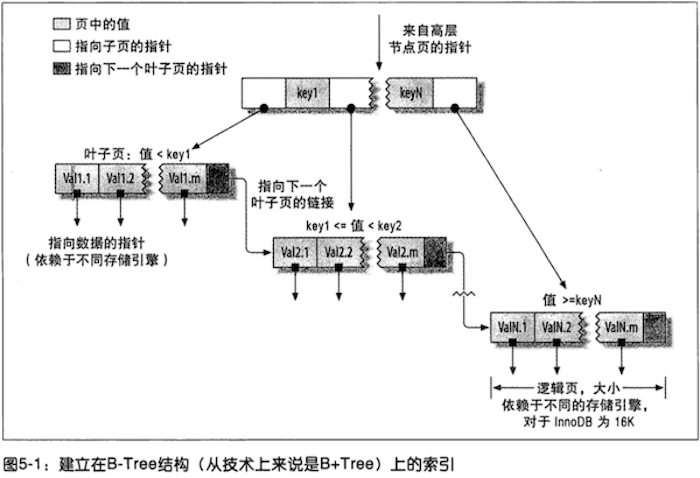
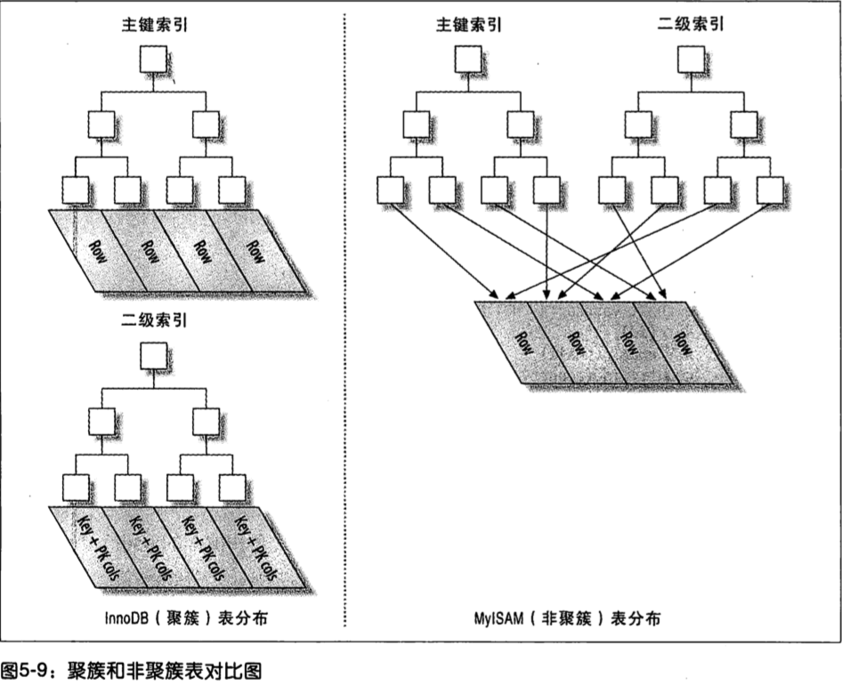

# 创建高性能的索引
## 5.1 索引基础
索引可以包含一个或多个列的值，列的顺序十分重要，因为MySQL只能高效的使用索引的最左前缀列。

### 5.1.1 索引的类型

#### B-Tree索引
存储引擎以不同的方式使用B-Tree索引，性能也各不相同。MyISAM使用前缀压缩技术是得索引更小，InnoDB使用的是B+Tree则按原数据格式进行存储。MyISAM索引通过数据的物理位置引用被索引的行，而InnoDB则根据主键引用被索引的行。

B-Tree通常意味着所有的值都是按顺序存储的，并且每一个叶子页到根的距离相同。叶子节点比较特殊，它们的指针指向的是被索引的数据，而不是其他的节点页。



B-Tree索引的限制：
1. 如果不是按照索引的最左列开始查找，则无法使用索引。
2. 不能跳过索引中的列。
3. 如果查询中由某个列的范围查询，则其右边所有列都无法使用索引优化查找。
   
有些限制并不是B-Tree本身导致，而是MySQL优化器和存储引擎使用索引的方式导致的。

#### 哈希索引
哈希索引是基于哈希表实现的，只有精确匹配索引的所有列的查询才有效。它的限制：
1. 哈希索引只包含哈希值和行指针，而不存储字段值，所以不能使用索引中的值来避免读取行
2. 哈希索引数据并不是按照索引值得顺序存储的，所以也就无法用于排序
3. 哈希索引也不支持部分索引列匹配查找，因为哈希索引始终是使用索列的全部内容来计算哈希值
4. 哈希索引只支持等值比较查询
5. 访问哈希索引的数据非常快，除非有很多哈希冲突
6. 如果有哈希冲突很多的话，一些索引维护操作的代价也会很高

#### 空间数据索引（R-Tree)
MyISAM表支持空间索引，可以用作地理数据存储。

#### 全文索引
全文索引是一种特殊类型的索引，它查找的是文本中的关键词，而不是直接比较索引中的值。全文搜索和其他几类索引的匹配方式完全不一样。它有许多需要注意的细节，如停用词、词干和复数、布尔搜索等。全文索引更类似于搜索引擎做的事情，而不是简单的WHERE条件匹配。

在相同的列上同时创建全文索引和基于值的B-Tree索引不会有冲突，全文索引适用于 `MATCH AGAINST` 操作，而不是普通的WHERE条件操作。

## 5.2 索引的优点
1. 大大减少了服务器扫描的数据量
2. 可以帮助服务器避免排序和临时表
3. 可以将随机I/O变为顺序I/O

## 5.3 高性能的索引策略
### 5.3.1 独立的列
独立的列是指索引列不能是表达式的一部分，也不能是函数的参数。例如，下面的查询就不能使用actor_id索引:

```sql
select actor_id from sakila.actor where actor_id + 1 = 5;
```

显然，where中的表达式其实等价于actor_id = 4，但是MySQL无法自动解析这个方程式。另外一个常见的错误：
```sql
SELECT ... WHERE TO_DAYS(CURRENT_DATE) - TO_DAYS(date_col) <= 10;
```

### 5.3.2 前缀索引和索引选择性
有时候需要索引很长的字符列，这会让索引变得大而且慢，通过可以索引开始的部分字符，这样可以大大节约索引空间，从而提高索引效率。但是也会降低索引的选择性。

索引的选择性是指不重复的索引值（也称为基数）和数据表的记录总数（#T）的壁纸，范围从1/#T到1之间。索引的选择性越高则查询的效率越高。

对于BLOB，TEXT或者很长的VARCHAR类型的列，必须使用前缀索引，因为MySQL不允许索引这些列的完整长度。诀窍在于要选择足够长的前缀以保证高的选择性，同时为了节约空间又不能太长。

计算不同前缀长度的选择性：


当前缀长度达到7时选择性的提升幅度已经很小了。找到合适的前缀索引长度后如何创建前缀索引呢？
```SQL
ALTER TABLE sakila.city_demo ADD KEY (city(7));
```
前缀索引是一种能够使索引更小更快的有效方法，但是 **MySQL无法使用前缀索引做ORDER BY 和 GROUP BY，也无法使用前缀索引做覆盖扫描** 。


### 5.3.3 选择合适的索引列顺序
经验法则：将选择性最高的列放到索引最前列。当不需要考虑排序和分组时，将选择性最高的列放在前面通常是很好的。性能不但和索引列的选择性有关，也和查询条件的值得分布有关。以下面的查询为例：
```sql
SELECT * FROM payment WHERE staff_id = 2 AND customer_id = 584;
```
在确定索引的顺序前，可以跑一些查询来确定在表中值得分布情况，查询情况：
```sql
mysql> SELECT SUM(stadff_id = 2), SUM(customer_id = 584) FROM payment;
+----------------------+------------------------+
| SUM(staff_id = 2)    | SUM(customer_id = 584) | 
+----------------------+------------------------+
| 7992                 | 30                     | 
+----------------------+------------------------+
```
根据前面的经验法则，应该把索引列customer_id放到前面，因为对应条件值的customer_id数量更小。不过最好还是按经验法则来做，因为经验法则考虑的是全局基数和选择性，而不是某个具体查询：

```sql
SELECT
    COUNT(DISTINCT staff_id) / COUNT(*) AS staff_id_selectivity,
    COUNT(DISTINCT customer_id) / COUNT(*) AS customer_id_selectivity,
    COUNT(*)
FROM payment\G
```
### 5.3.5 聚簇索引
聚簇索引并不是一种单独的索引类型，而是一种数据存储方式。具体的细节依赖于其实现方式，但InnoDB的聚簇索引实际上是同一个结构中保存了B+Tree索引和数据行。当表由聚簇索引时，它的数据行实际上是存放在索引的叶子页中。术语”聚簇“表示数据行和相邻的键值紧凑的存储在一起。（非聚簇索引就是指B+Tree的叶子节点上的data，并不是数据本身，而是数据存放的地址。）

因为无法同时把数据行存放在两个不同的地方，所以一个表只能有一个聚簇索引。不是所有的存储引擎都支持聚簇索引。下图展示了聚簇索引中的记录和数据是如何存放的。


非聚簇索引，又叫二级索引。二级索引的叶子节点中保存的不是指向行的物理指针，而是行的主键值。当通过二级索引查找行，存储引擎需要在二级索引中找到相应的叶子节点，获得行的主键值，然后使用主键去聚簇索引中查找数据行，这需要两次B-Tree查找。


聚簇索引可能对性能有帮助，也有可能导致严重的性能问题。
【优点】
1. 可以把相关的数据保存在一起
2. 数据访问更快
3. 使用覆盖索引扫描的查询可以直接使用叶节点中的主键值

【缺点】
1. 聚簇数据最大限度的提高了I/O密集型应用的性能，但是如果数据都存放在内存中，则访问的顺序就没那么重要了，聚簇索引也就没有什么优势了。
2. 插入速度严重依赖于插入顺序。按照主键的顺序插入式加载数据到InnoDB表中速度最快的方式，但如果不是，那么在加载完成后最好使用`OPTIMIZE TABLE`命令重新组织一下表。
3. 更新聚簇索引列的代价很高，因为强制InnoDB将每个被更新的行移动到新的位置。
4. 移动式可能面临”页分裂“的问题，导致表占用更多的磁盘空间。
5. 聚簇索引可能导致全表扫描变慢，尤其是行比价哦系数或者由于页分裂导致数据存储不连续的时候。
6. 二级索引（非聚簇索引）可能比想象中的大，因为二级索引的叶子节点包含了行的主键列。
7. 二级行访问需要两次查找，而不是一次。二级索引中保存的是“行指针”，存储引擎找到二级索引的叶子节点或得对应主键值，然后通过主键值去聚簇索引中查找到对应的行。

#### 在InnoDB中按主键顺序插入行
如果正在使用InnoDB表并且没有什么数据需要聚集，那么可以定义一个代理键(surrogatekey)作为主键，这种主键的数据应该和应用无关，最简单的方法是使用 `AUTO_ INCREMENT` 自增列。这样可以**保证数据行是按顺序写人，对于根据主键做关联操作的性能也会更好**。

### 5.3.6 覆盖索引
如果索引的叶子结点中已经包含（或者说覆盖）要查询的数据，则称之为覆盖索引。

### 5.3.7 使用索引扫描来做排序
MySQL可以通过（1）排序操作或者（2）按索引顺序扫描来生成有序结果。（如果EXPLAIN出来的type列值为index，则说明MySQL使用了索引扫描来做排序，不要和Exta列的“Using index”搞混淆了）。

1. 只有当索引的列顺序和`ORDER BY`子句的顺序完全一致，并且所有列的排序方向（倒序或者正序）都一样时，MySQL才可以使用索引来对结果做排序。
2. 如果查询需要关联多张表，则只有当`ORDER BY`子句引用的字段全部为第一个表时，才能使用索引做排序。`ORDER BY`子句和查找型查询的限制是一样的：需要满足索引的最左前缀的要求

否则，MySQL都需要执行排序操作，无法利用索引排序。

### 5.3.8 压缩（前缀压缩）索引
MyISAM使用前缀压缩来减少索引的大小，提高性能。其方法是：先完全保存索引块中的第一个值，然后将其他值和第一个值进行比较得到相同前缀的字节数和剩余的不同后缀部分，把这部分存储起来即可。例如第一个值为“perform”，第二个值为“performance”，那么第二个值可以压缩为“7,ance”。

压缩块可以减少空间，但是操作可能更慢，并且后面的值依赖前面的值。正序扫描速度还不错，但是倒序扫描就不是很好了。

### 5.3.9 冗余和重复索引


