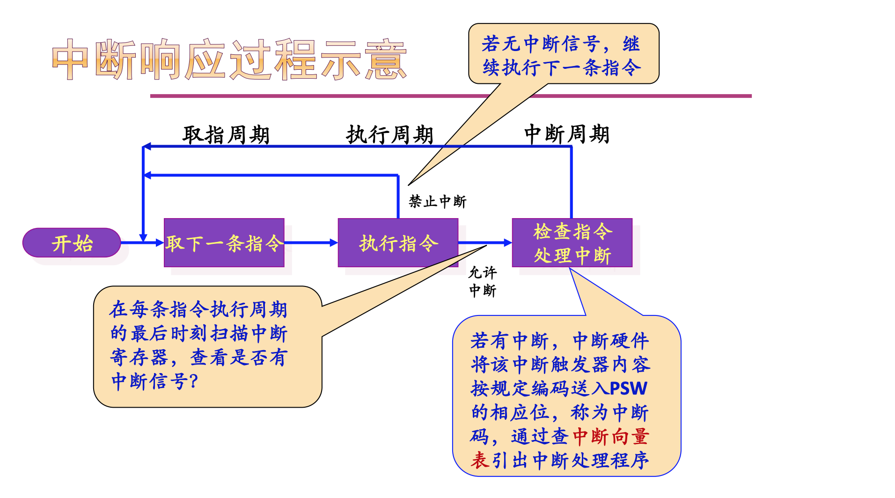
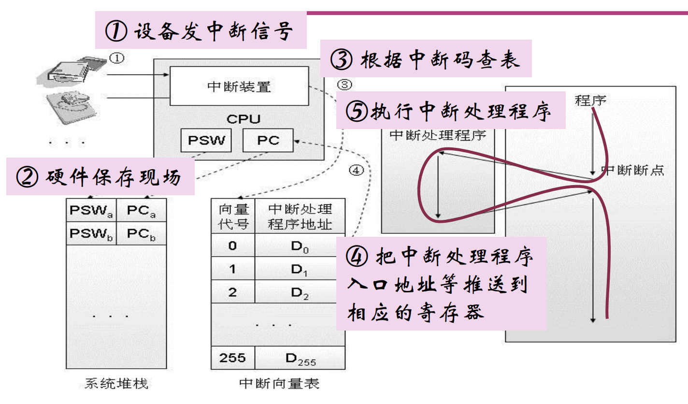

# 操作系统

>  课件：
>
> 1. [操作系统概述](./pdf/01.pdf)
> 2. [操作系统运行环境](./pdf/02.pdf)
> 3. [进程线程模型](./pdf/03.pdf)
> 4. [处理器调度](./pdf/04.pdf)
> 5. [同步机制(1)](./pdf/05.pdf)
> 6. [同步机制(2)](./pdf/06.pdf)
> 7. [存储模型(1)](./pdf/07.pdf)
> 8. [存储模型(2)](./pdf/08.pdf)
> 9. [文件系统(1)](./pdf/09.pdf)
> 10. [文件系统(2)](./pdf/10.pdf)
> 11. [I/O系统](./pdf/11.pdf)
> 12. [死锁](./pdf/12.pdf)

## 操作系统运行环境

### 处理器状态

常见的控制和状态寄存器：

- 程序计数器（PC：program counter）， 记录即将要去除的指令的地址
- 指令寄存器（IR：instruction register），记录最近取出的指令
- 程序状态字（PSW：program status word），记录处理器的运行状态如条件码、模式、控制位等信息

需要硬件提供基本运行机制：

- 处理器具有特权级别，能在不同的特权级运行的不同指令集合
- 硬件机制可将OS与用户程序隔离

现代处理器通常将CPU状态设计划分为多种状态， 在PSW中专门设置以为，根据运行程序对资源和指令的使用权限而设置不同的CPU状态。

### 操作系统需要

两种CPU状态：

- 内核态（Kernel Mode）：运行操作系统程序
- 用户态（User Mode）：运行用户程序

- **特权指令** 只能由操作系统使用，用户程序不能使用的指令
- **非特权指令** 用户程序可以使用的指令

x86支持4个处理器特权级别：R0，R1，R2和R3， R0相当于内核态，R3相当于用户态，R1和R2介于两者之间，不同级别能够运行的指令集合不同。

### CPU状态之间的转换

- 用户态 -> 内核态

  唯一途径： **中断/异常/陷入机制**

- 内核态 -> 用户态

  设置程序状态字PSW

### 中断与异常机制

### 中断/异常的概念

- CPU对系统发生的某个事件作出的一种反应
- CPU暂停正在执行的程序，把刘现场后自动转去执行相应事件的处理程序，处理完成后返回断点，继续执行被打断的程序

特点：

- 是随机发生的
- 是自动处理的
- 是可以恢复的

 **中断**： 为了支持CPU和设备之间的并行操作。当设备完成I/O后，通过向CPU发送中断报告，让CPU界定如何处理后续的事情。包括：

		- I/O中断
		- 时钟中断（如CPU时间片到了）
		- 硬件故障

**异常**： 表示CPU执行指令时本身出现的问题，如算数溢出，访问内存地址时越界或者执行了陷入指令等。这时硬件改变了CPU当前的执行流程，转到相应的错误处理程序或异常处理程序或系统调用。包括：

- 系统调用
- 页故障/页错误
- 保护性异常
- 断点指令
- 其他程序性异常

### 中断与异常的工作原理

- 硬件该做什么事？ --- 中断/异常**响应**
  - 捕获中断源发出的中断/异常请求，以一定的方式响应，将处理器控制权交给特定的处理程序
- 软件要做什么事？ --- 中断/异常**处理**程序
  - 识别中断/异常类型并完成相应的处理

### 中断与异常的工作原理

中断响应过程示意 

CPU在每条执行周期的最后**扫描中断寄存器**，查看是否有中断信号。

中断响应过程示意

### 系统调用机制

系统调用是操作系统提供给编程人员的唯一接口，使得CPU状态从用户态陷入内核态。

