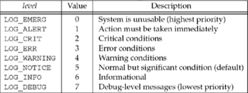

# 守护进程和inetd超级服务器
守护进程（daemon）是在后台运行且不与任何终端关联的进程。守护进程通常没有控制终端，为了避免与作业控制、终端会话管理等发生不期望的任何交互，也为了避免非预期的输出到终端。

因为守护进程没有控制终端，因此需要专门的方法来输出守护进程产生的消息。`syslog`函数是输出这些消息的标准方法，它把这些消息发送给`syslogd`守护进程。

## syslogd守护进程
Unix系统中的syslog通常随着系统的初始化脚本而启动，而且在系统运行期间一直运行。源自Berkeley的syslogd实现在启动时通常会执行以下操作：
1. 读取配置文件（/etc/syslog.conf），指定本进程如何处理各种日志消息，如写到控制台或者转发到另一台主机上的syslogd进程；
2. 创建Unix域套接字，给它捆绑路径名/var/run/log(在某些系统上是/dev/log)；
3. 创建UDP套接字，绑定514端口；
4. 打开路径名/dev/klog。来自内核的任何出错消息都会作为这个设备的输入。

此后syslogd守护进程在一个无限循环中运行：调用select等待2，3，4步描述符之一变得可读，读入日志消息，并按照配置文件进行处理。如果守护进程收到`SIGHUP`信号，那就重新读取配置文件。

## syslog 函数
```c
#include <syslog.h>
void syslog(int priority, const char *message, ...);
```

syslog是守护进程登记消息的常用技巧。

`priority`是`级别（level）`和`设施（facility）`两者的结合。级别默认为`LOG_NOTICE`。设施默认为`LOG_USER`。

#### 日志消息级别




#### 日志消息设施


`messsage`参数类似于`printf`的格式串，不过增设了`%m`规范，它将被替换成与当前`error`值对应的出错消息。message参数的末尾可以出现一个换行符，不过并非必须。

当syslog被首次调用时，它创建一个UNIX域套接字，然后调用connect函数连接到syslogd守护进程创建的域套接字的众所周知路径名（譬如/var/run/log）。这个套接字一直打开，直到进程终止为止。进程也可以通过`openlog`和`closelog`来代替。

```c
#include <syslog.h>
void openlog(const char *ident, int options, int family);
void closelog(void);
```
openlog可以在首次调用syslog前调用，closelog可以在应用进程不再发送日志消息时调用。`ident`通常是程序名，是syslog加在每条日志消息之前的字符串。`options`参数由下表所示的一个或多个常值的逻辑或构成。

|options|说明|
|:---|:---|
|LOG_CONS|若无法发送到syslogd守护进程则登记到控制台|
|LOG_NDELAY|不延迟打开，立即创建套接字。默认在首次调用syslog时创建|
|LOG_PERROR|既发送到syslogd，又登记到标准错误输出|
|LOG_PID|随着每个日志消息登记进程ID|

### 守护进程例子

#### unp.h
```c{9,10,14,16,27}
#include <netdb.h>
#include <stdio.h>
#include <stdlib.h>
#include <stdarg.h>
#include <arpa/inet.h>
#include <string.h>
#include <unistd.h>
#include <sys/socket.h>
#include <syslog.h>
#include <fcntl.h>

#define MAX_BUFF_SIZE   1024
#define LISTENQ 5
#define MAX_FD_SIZE 64

int is_daemon_proc;

void err_msg(const char *, va_list);
void err_printf(const char *, ...);
void err_quit(const char *, ...);
struct addrinfo *host_serv(const char *, const char *, int, int);
int tcp_connect(const char *, const char *);
int tcp_listen(const char *, const char *, socklen_t *);
int udp_client(const char *, const char *, struct sockaddr **, socklen_t *);
int udp_connect(const char *, const char *);
int udp_server(const char *, const char *, socklen_t *);
int daemon_init(const char *, int);
```

#### daemon.c
<<<@/clang/src/inetd/daemon.c{1-80}

#### unp.c
<<<@/clang/src/inetd/unp.c{8-11}

#### TCP时间服务器守护进程
<<<@/clang/src/inetd/daytimetcpsrv.c{12}

#### 编译 Makefile
```makefile
unp.o: unp.c
	$(CC) -c $^

daemon.o: daemon.c
	$(CC) -c $^

daytimetcpsrv.o: daytimetcpsrv.c
	$(CC) -c $^

server: daytimetcpsrv.o unp.o daemon.o
	$(CC) -o $@ $^

.PHONY: all clean

all: server

clean:
	rm -rf *.o *.gch server
```

## inetd 守护进程
4.3BSD版本通过提供一个因特网超级服务器（即`inetd`守护进程）使上述问题得到简化。基于TCP或UDP的服务器都可以使用这个守护进程。它：
1. 通过由inetd处理普通守护进程的大部分启动细节以简化守护进程的编写
2. 单个进程就能为多个服务等待外来的客户请求，以此取代每个服务一个进程的做发，减少了系统的进程总数。

inetd读入并处理自己的配置文件（通常是/etc/inetd.conf），配置指定了本超级服务器处理哪些服务以及当一个服务请求达到时该怎么做。其工作流程如下图：


