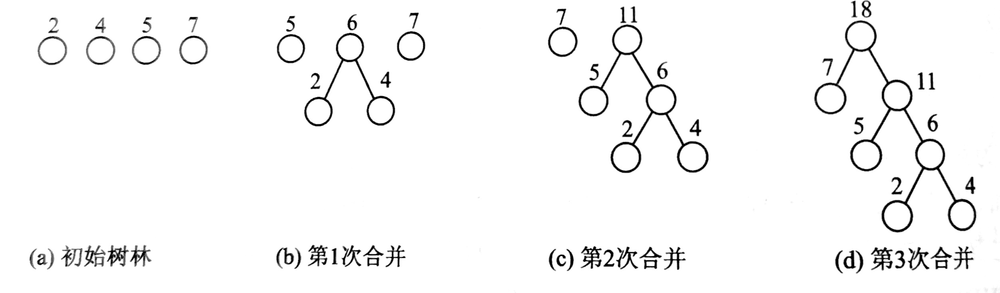
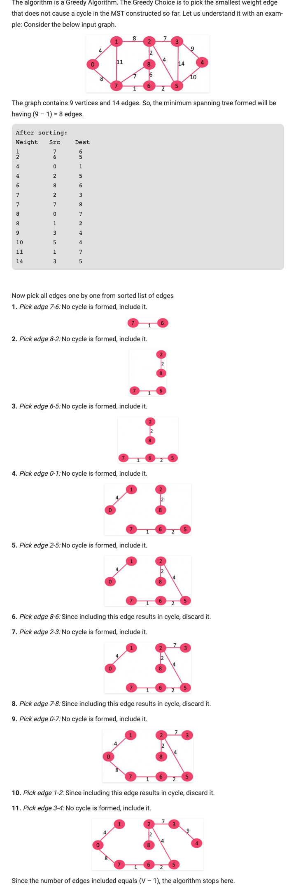

# 数据结构

## 线性表
线性表是由n(n>=0)个属于同一个数据对象的数据元素a<sub>1</sub>,a<sub>2</sub>,a<sub>3</sub>...a<sub>n-1</sub>,a<sub>n</sub>组成的有序列。在计算机内部可以采用不同方式存储一个线性表，其中最简单的方式就是用一组地址连续的存储单元来依次存储线性表中的数据元素。这种存储结构称为 **线性表的顺序存储结构** ，此时称为**顺序表**；还有一种线性表的存储结构——**链式存储结构**，也称为**线性链表**或者**单链表**。

C语言示例：

<<<@/datastructure/linklist.c

## 堆栈
堆栈（stack）简称栈，它是一种只允许在表的一段进行插入和删除操作的线性表。允许操作的一端称为栈顶，栈顶元素的位置由一个称为栈顶指针的变量给出，另一端称为栈低。当表中没有元素时，称之为空栈。堆栈的插入操作简称为入栈或者进栈，删除操作称为出栈或者退栈。

一般将采用顺序存储结构的堆栈简称为**顺序堆栈**，可以利用一个具有M个元素的数组来描述。这种堆栈的优点是可以节省空间，但是当存储空间即将充满时，需要移动大量的数据元素到新的数组中。堆栈还有另外一种存储方式——堆栈的链式存储，称之为**链接堆栈**， 简称**链栈**。

C实现链栈：

<<<@/datastructure/stack.c

## 队列
队列（queue），简称队，是一种只允许在表的一端进行插入操作，而在表的另一端进行删除操作的线性表。元素进入队列或者退出队列都是按照“先进先出（First In first Out，FIFO）”的原则进行的，因此，队列也称为**先进先出表**。

C 数组实现：

<<<@/datastructure/queue_array.c

C 链表实现：

<<<@/datastructure/queue_linklist.c

## 广义表
在一个线性表A中，每个数据元素只限于是结构上不可再分割的原子元素，而不能是其他情况，如果放宽这个限制，允许表中的元素即可是原子元素，也可以是另外一个表，则称这样的表为**广义表**。
设a<sub>i</sub>为广义表的第i个元素,则广义表GL的一般表示与线性表相同：
    GL=(a<sub>1</sub>,a<sub>2</sub>,…,a<sub>i</sub>,…,a<sub>n</sub>)

其中n表示广义表的长度，即广义表中所含元素的个数，n≥0。如果a<sub>i</sub>是单个数据元素，则a<sub>i</sub>是广义表GL的原子；如果a<sub>i</sub>是一个广义表，则a<sub>i</sub>是广义表GL的子表。 

广义表具有如下重要的特性：
1. 广义表中的数据元素有相对次序；
2. 广义表的长度定义为最外层包含元素个数；
3. 广义表的深度定义为所含括弧的重数。其中原子的深度为0，空表的深度为1；
4. 广义表可以共享；一个广义表可以为其他广义表共享；这种共享广义表称为再入表；
5. 广义表可以是一个递归的表。一个广义表可以是自已的子表。这种广义表称为递归表。递归表的深度是无穷值,长度是有限值；
6. 任何一个非空广义表GL均可分解为表头head(GL) = a1和表尾tail(GL) = ( a2,…,an) 两部分。 

另外,我们规定用小写字母表示原子，用大写字母表示广义表的表名。例如：
```
A=()
B=(e)
C=(a,(b,c,d))
D=(A,B,C)=((),(e),(a,(b,c,d)))
E=((a,(a,b),((a,b),c)))
```
其中A是一个空表，其长度为0；
B是只含有单个原子e的表，其长度为1；
C有两个元素，一个是原子a，另一个是子表，其长度为2；
D有三个元素，每个元素都是一个表，其长度为3；
E中只含有一个元素，是一个表，它的长度为1。

广义表是一种递归的数据结构，因此很难为每个广义表分配固定大小的存储空间，所以其存储结构只好采用动态链式结构。

C 实现：

<<<@/datastructure/generalized_list.c

## 串
串是由n(n>=0)个字符组成的有序序列，通常记作： S = 'a<sub>1</sub>,a<sub>2</sub>,…,a<sub>i</sub>,…,a<sub>n</sub>'。

## 树
树（tree）是由n（n>=0）个结点组成的有穷集合（D）与在D上关系的集合R构成的结构，记成T。

1. 基本术语

- **结点的度**    结点拥有的子树数目称为该结点的度。
- **树的度**    树中各结点度的最大值被定义为该树的度。
- **叶子结点**  度为0的结点被称为分支节点或者终端结点，简称为叶结点。
- **分支结点**  度不为0的结点称为分支结点或者非终端结点。
- **结点的层次**    从根结点所在开始，根结点为第1层，根节点的孩子结点为第2层，以此类推。
- **树的深度**  树中结点的最大层次数被定义为该树的深度或者高度。
- **有序树**    若树中结点子树的相对次序不能随意变换，或者说改变前后的树表示的不是同一个对象，则称该树为有序树。
- **森林**  m(m>=0)棵不相交的树的集合被称为森林或者树林。对树中的每个分支结点来说，其子树的集合就是一个森林。

2. 树的性质
- **性质一** 非空树的结点总数等于树中所有结点的度之和加1。
- **性质二** 度为K的非空树的第i层最多有k<sup>i-1</sup>个结点（i>=1）。（数学归纳法证明）
- **性质三** 深度为h的k叉树最多有(k<sup>h</sup> - 1) / (k - 1)个结点。该树称为满K叉树，
- **性质四** 具有n个结点的k叉树的最小深度为[log<sub>k</sub>(n(k-1) + 1)]。

### 二叉树
二叉树是n(n>=0)个结点的有穷集合D与D上关系集合R构成的结构。当n=0时为空二叉树，否则它便是包含了一个根结点以及两棵不相交的、分别称为左子树和右子树的二叉树。一般称左子树的根结点为该分支结点的左孩子，右子树的根结点称作该分支结点的右孩子。

1. 两种特殊形态的二叉树
- 一棵深度为h且有2<sup>h</sup> - 1个结点的二叉树就是**满二叉树**。
- 若二叉树中最多只有最下面的两层结点的度可以小于2，并且最下面的结点（叶结点）都依次排列在该层最左边的位置上，具有这样的特定的二叉树称为**完全二叉树**。

2. 二叉树的性质
- **性质一** 具有n个结点的非空二叉树有且仅有n-1个分支。
- **性质二** 非空二叉树的第i层最多有2<sup>n-1</sup>个结点
- **性质三** 深度为h的非空二叉树最多有2<sup>h</sup> - 1个结点
- **性质四** 在任意非空二叉树中，若叶结点的数目为n<sub>0</sub>，度为2的结点数目为n<sub>2</sub>，则关系有n<sub>0</sub> = n<sub>2</sub> + 1。
- **性质五** 具有n(n>0)个结点的完全二叉树的深度为h = （log<sub>2</sub>n） + 1。
- **性质六** 如果对一棵有n个结点的完全二叉树的结点按层序编号（从第一层到最后一层，每层从左到右），对任一结点i（1<=i<=n）有：
  - 如果i=1，则结点i是二叉树的根，无双亲；如果i>1，则其双亲是结点 ⌊ i/2 ⌋ 。
  - 如果2i>n，则结点i无左孩子（结点i为叶子结点）；否则其左孩子是结点2i 。
  - 如果2i+1>n，则结点i无右孩子；否则其右孩子是结点2i+1 。

C 示例1：由广义表形式建立相应的二叉链表结构

<<<@/datastructure/btree_1.c

C 示例2：由顺序列表存储结构建立相应的二叉链表结构

<<<@/datastructure/btree_2.c

C 示例3：二叉链表存储结构的二叉树的结点数目和树的深度，树的遍历

<<<@/datastructure/btree_3.c {70-82,84-95,97-111,113-126,128-141,143-165}

### 二叉排序树
**二叉排序树（Binary sort tree）** 是一棵二叉树，若根结点的左子树不为空，则左子树中所有的结点的值都小于根节点的值；若右子树不为空，则右子树的所有结点的值均大于或等于根节点的值。

C 示例：

<<<@/datastructure/bstree.c

#### 查找的长度
在二叉排序树的中查找数据信息与给定值相匹配的结点的过程正好走了一条从根结点到该结点的路径，与给定值所进行的比较次数等于该结点所在层次数。对于二叉排序树的查找算法的优劣性通常采用 **平均查找长度(Average Search Length, ASL)** 的概念来衡量。ASL确定一个元素在树中的位置所需要进行的比较次数的期望值。

从二叉树根结点到某结点所经过的分支数目定义为该结点的路径长度。二叉树内所有结点的路径长度之和为该二叉树的**内路径长度(Internel Path Length, IPL)**。

为了分析查找失败时的查找长度，在二叉树中出现空子树时，增加新的空叶结点来代表这些空子树，从而得到一棵扩充后的二叉树，称之为外部结点，树中原有的结点称为内部结点。内外部结点的路径长度和称为**外路径长度(External Path Length, EPL)**。

由归纳法可以证明 `EPL = IPL + 2n`。设对每个结点（包括外结点）进行查找的概率相等，则平均查找长度为:

` ASL = (2IPL + 3n) / (2n + 1)`

- 内路径长度最小时二叉排序树具有最小的平均查找长度，此时称之为最佳二叉排序树。 O(log<sub>2</sub>n)量级。
- 最坏的情况下，二叉树退化成一棵单枝的二叉树，其平均长度为(n+1)/2，是O(n)量级，与顺序查找相同。

### 平衡二叉树
平衡二叉树(balanced binary tree或height-balanced tree)又称AVL树(得名于它的发明者G.M. Adelson-Velsky 和E.M. Landis)。它是具有下列性质的二叉树：二叉树中每个结点的左、右子树的深度之差的绝对值不超过1。把二叉树中的每个结点的左子树深度与右子树深度之差定义为该结点的平衡因子（-1， 0或者1）。

- **LL型调整**      对由于在结点A的左(L)孩子（用B表示）的左（L）子树上插入结点，使得点A的平衡因子由1变成2而引起的不平衡所进行的调整操作。
- **RR型调整**      对由于在结点A的右(R)孩子（用B表示）的右（R）子树上插入结点，使得点A的平衡因子由-1变成-2而引起的不平衡所进行的调整操作。
- **LR型调整**      对由于在结点A的左(L)孩子（用B表示）的右（R）子树上插入结点，使得点A的平衡因子由1变成2而引起的不平衡所进行的调整操作。
- **RL型调整**      对由于在结点A的右(R)孩子（用B表示）的左（L）子树上插入结点，使得点A的平衡因子由-1变成-2而引起的不平衡所进行的调整操作。
  
### 哈夫曼树(Huffman)
若设二叉树有m个叶结点，每个叶结点分别赋予一个权值，则二叉树的带权路径长度为

WPL = w<sub>1</sub>l<sub>1</sub> + w<sub>2</sub>l<sub>2</sub> + ... + w<sub>m</sub>l<sub>m</sub>

给定一组权值，构造出的具有最小带权路径长度的二叉树称为**哈夫曼树**， 又称为**最优叉树**。构造最优WPL的叉树的算法是哈夫曼给出的，称为哈夫曼算法。
1. 将w1、w2、…，wn看成是有n 棵树的森林（每棵树仅有一个结点）；
2. 在森林中选出根结点的权值最小的两棵树进行合并，作为一棵新树的左、右子树，且新树的根结点权值为其左、右子树根结点权值之和；
3. 从森林中删除选取的两棵树，并将新树加入森林；
4. 重复2、3步，直到森林中只剩一棵树为止，该树即为所求得的哈夫曼树。
以{2,4,5,7}为例，来构造一棵哈夫曼树。



#### 哈夫曼编码
哈法曼编码是一种无损的数据压缩算法。算法的基本思想是给输入的字符分配变长的编码，编码的长度取决于相应字符出现的频率。频率越高的字符分配越短的编码，频率越低的字符则分配越长的编码。

分配给输入字符的变长编码称为`字首码(Prefix Codes)`，一个字符对应的编码（位序列，bit sequences）不是其他任何一个字符的编码的前缀。这能确保哈夫曼编码解码生成的字节流时不会产生歧义。举个例子，假设四个字母对应的a，b，c，d和相应的变长编码00， 01， 0和1。这种编码会导致歧义，因为c对应的编码是a和b对应编码的前缀。假设有编码的字节流是0001，那么解码后的输出可能是”cccd“或者”ccb“或者”acd“或者”ab“。

C 示例：
实现步骤：
1. 为每个不同的字符创建一个树结点，然后建立一个最小堆（最小堆用来排序，最小堆中的不同结点通过频率的大小来比较。最开始，根节点的频率最低）；
2. 从最小堆中取出频率最低的两个结点；
3. 对这两个结点求和并创建一个新的内部结点。第一个取出的结点左右它的左孩子，另外一个作为右孩子。将这个新的内部结点加入到最小堆中；
4. 重复2，3知道这个堆只包含一个结点。剩下的最后一个结点是根节点。

举例说明：
```
1. 建立最小堆后
character   Frequency
    a           5
    b           9
    c           12
    d           13
    e           16
    f           45

2. 从最小堆中取出最小的两个结点。增加一个新的内部结点，频率为 5 + 9 = 14
character           Frequency
       c               12
       d               13
Internal Node         14
       e               16
       f               45

3. 重复2
character           Frequency
Internal Node          14
       e               16
Internal Node          25
       f               45

4. 重复2
character          Frequency
Internal Node         25
Internal Node         30
      f               45 

5. 重复2
character     Frequency
       f         45
Internal Node    55

6. 重复2
character      Frequency
Internal Node    100

7. 最终得到的树如下图，打印编码
character   code-word
    f          0
    c          100
    d          101
    a          1100
    b          1101
    e          111
```


<<<@/datastructure/huffman_encoding.c

## 图
`图(graph)`是由顶点的非空有限集合V(由n>0个顶点组成)与边的集合E（顶点之间的关系）构成的。一般称图中的一个数据元素为一个 `顶点(vertex)`，两个顶点之间的关系称为`边(edge)` 或`弧(arc)`。若图G中的每天边都是没有方向的则称之为`无向图`，反之为`有向图`。与边有关的数据信息称为`权`，每条边上都带有权的图称为`网络`，简称`网`。

顶点的`度`是指依附于某顶点的边数。有向图顶点的`入度`是指以顶点为终点的弧的数据。顶点的`出度`是指以顶点为始点的弧的数目。出度和入度之和就是顶点的度。

具有n个顶点的无向图最多有n(n-1)/2条边，称这样的图为`完全图`。具有n个顶点的有向图最多有n(n-1)条边，这样的有向图称为`有向完全图`。若一个图接近于完全图，称为`稠密图`，反之称为`稀疏图`。

如果无向图中任意两个顶点之间都是连通的，则称该无向图为`连通图`。无向图中的极大连通子图称为该图的`连通分量`。若有向图中的任意两个顶点都是连通的（v1到v2和v2到v1都是连通的），则称该有向图为`强连通图`，有向图中的极大强连通子图称为该有向图的`强连通分量`。

若图为包含n个顶点的连通图，所谓该图的`生成树`是该图的一个包含全部n个顶点的极小连通子图，并且该子图一定包含且仅仅包含该图的n-1条边。

一个有向图的`生成森林`由若干棵有向树组成，包含图中的全部顶点，但只有足以构成若干棵不相交的有向树的弧。

### 图的存储方法
#### 邻接矩阵存储方法
定义一个二维数组A[0..n-1][0..n-1]，该二维数组通常被称为`邻接矩阵`，元素A[i][j]存放顶点i到顶点j之间的关系信息。

#### 邻接表存储方法
邻接矩阵存储方法不适合稀疏图，而实际经常遇到的大多数问题又不是稠密图，一个较好的解决办法就是邻接表存储方法。

在这种存储方法里，对于每一个顶点都建立一个线性链表，链表的前面设置一个头结点，每个顶点结点由两个域组成，顶点域(vertex)用来存放某个定点的数据信息，指针域(link)用来存放该顶点的第一个边所对应的链接点的地址。为了方便呢随机访问任意一个顶点的链表，所有的表头都会存储在一个数组中。

C 示例：

<<<@/datastructure/graph_01.c

### 图的遍历
遍历图的方式通常有两种，分别是`深度优先搜索`和`广度优先搜索`。以下图为例，分别实现图的两种遍历方式。


<<<@/datastructure/graph_traversal.c

### 最小生成树
<i>什么是最小生成树？</i>

对于一个连通的无向图来说，它的一个连通树就是该图的子图，这个子图连接了所有的顶点。一个图可以有很多不同的连通树。**最小生成树( Minimum Spanning Tree, MST)** 是带权无向连通图的一棵权和最小（或者其他所有连通树相等）的连通树。连通树的权值就是该连通树所有边的权值之和。

<i>最小生成树有多少个边呢？</i>

假设图由V个顶点，那么最小连通树由（V-1）个边。

构造最小生成树的基本原则是：
1. 只能使用该连通图的边来构造最小生成树；
2. 只能使用并且仅能使用n-1条边来连接该连通图的n个顶点；
3. 不能使用产生回路的边。
   
构造最小生成树的方法有很多种，比较典型的方法是**普利姆** 算法和**可如斯卡尔** 算法。

#### 可如斯卡尔 Kruskal’s Minimum Spanning Tree Algorithm
通过可如斯卡尔算法查找MST的步骤：
1. 按权值大小升序排列所有的边；
2. 选择最小的边。检查它是否和现有的树形成回路，如果没有则保留该边，所有弃用；
3. 重复2直到生成树中有V-1条边。

举一个例子：




#### 普利姆算法 Prim’s Minimum Spanning Tree (MST)


## 参考
- [《数据结构教程(第3版) 唐发根编著》](https://item.jd.com/12106775.html)
- [哈夫曼算法的理解及原理分析,算法实现,构造哈夫曼树的算法 - 全文](http://www.elecfans.com/rengongzhineng/600143_a.html)
- [Huffman Coding](https://www.geeksforgeeks.org/huffman-coding-greedy-algo-3/)
- [Kruskal’s Minimum Spanning Tree Algorithm](https://www.geeksforgeeks.org/?p=26604/)
- [Prim’s Minimum Spanning Tree (MST)](https://www.geeksforgeeks.org/prims-minimum-spanning-tree-mst-greedy-algo-5/)