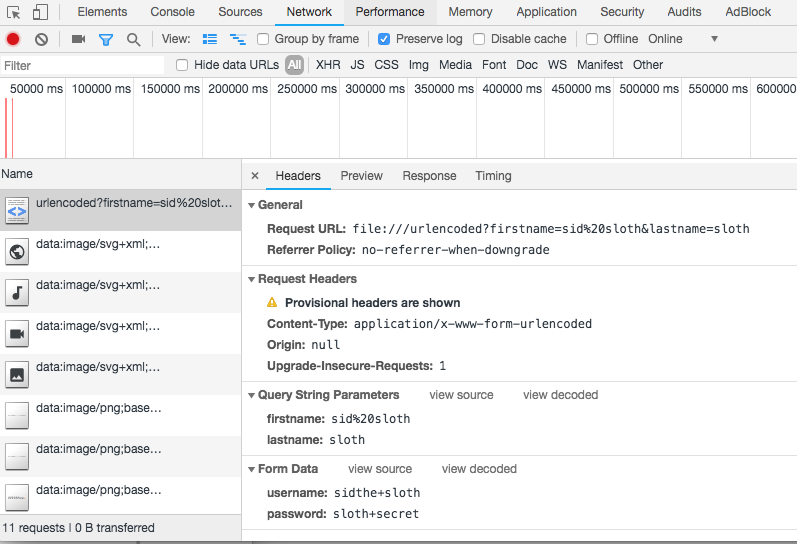

# cURL和multipart/form-data

## cURL的基本用法
通过cURL可以实现很多的网络请求，包括`POST`发送文件。输入`curl -X POST`来开始curl请求，表单的参数可以通过`-F`参数来添加，如：
```bash
curl -X POST -F 'username=foo' -F 'password=bar' http://somesite/login
```

如果服务端用的是`PHP`开发，可以通过`print_r`打印查看`$_POST`全局变量来确认服务端接收到的是不是期望的数据：
```php
Array(
    'username' => 'foo',
    'password' => 'bar'
)
```
很多网站会通过`header`或者`body`中的数据来验证用户身份，cURL也可以添加特定的数据类型或者请求头：
```bash
# -d 发送原始数据
curl -X POST -H 'Content-Type: application/json' -d '{"username":"foo","password":"bar"}' http://somesite/login
```

## multipart/form-data

什么是`multipart/form-data`呢？又如何用cURL发送`multipart/form-data`请求呢？

先说说表单的编码类型。表单的类型是通过属性`enctype`来决定，它有三种取值：

- `application/x-www-form-urlencoded` 表示URL编码了的表单，是`enctype`的默认值，`enctype`取值无效时也取该值。
- `multipart/form-data` 表示的是Multipart表单，当用户想上传文件时需要使用。
- `text/plain` 是HTML5中新出现的一个表单类型，简单的发送数据，而不经过任何的编码。

### URL编码表单
我们来写一个表单来测试看。
```html
<!DOCTYPE html>
<html>
<head>
    <meta charset="utf-8" />
    <meta http-equiv="X-UA-Compatible" content="IE=edge">
    <title>URL Encode</title>
    <meta name="viewport" content="width=device-width, initial-scale=1">
</head>
<body>
    <form action="/urlencoded?firstname=sid sloth&lastname=sloth" method="POST" enctype="application/x-www-form-urlencoded">
        <input type="text" name="username" value="sidthe sloth" />
        <input type="text" name="password" value="sloth secret" />
        <input type="submit" value="Submit" />
    </form>
</body>
</html>
```

上面的例子是一个发送`POST`请求表单，通过Chrome的开发这工具我们可以看到请求的是如何提交的。



URL编码其实就是一个由`name`和`value`构成的字符串，每个`name`和`value`之间通过`=`连接，`name`和`value`对和对之间通过`&` 连接，如：

```
key1=value1&key2=value2
```
我们还可以发现请求URL中的参数和请求体中的数据是相似的。不同的是`sid sloth`中的`%20` 和  `+`。

### Multipart Forms
Multipart Forms通常在我们上传文件是会用到，要想了解它是如何工作的，我们只需要把`enctype`的值修改为`multipart/form-data`。

```html
<form action="/multipart?firstname=sid slayer&lastname=sloth" method="POST" enctype="multipart/form-data">
    <input type="text" name="username" value="sid the sloth"/>
    <input type="text" name="password" value="slothsecret"/>
    <input type="submit" value="Submit" />
</form>
```

点击提交后，我们再看看浏览器为我们做了什么。


下面我们分别来看看 `Content-Type`头和请求体。
#### Content-Type头

`Content-Type`请求头的值显然是`multipart/form-data`，但同时我们可以看到其后方还有一个值`boundary`。这个`boundary`是浏览器生成的，用户也可以自动，稍后我们再研究它的用途。

#### 请求体

请求体包含了表单的数据，每个`name`和`value`对都转换成 MIME 格式：

```
--<<boundary_value>>
Content-Disposition: form-data; name="<<field_name>>"

<<field_value>>
```

`<<boundary_value>>`、`<<field_name>>`和`<<field_value>>`分别表示`boundary`值，`name`和`value`的值。`boundary_value` 加上前缀和后缀`--`作为整个请求体的结束标志。所以整个请求体的结构如下：

```
--<<boundary_value>>
Content-Disposition: form-data; name="<<field_name>>"

<<field_value>>
--<<boundary_value>>
Content-Disposition: form-data; name="<<field_name>>"

<<field_value>>
--<<boundary_value>>--
```

由上所知，Content-Type请求头中的`boundary`值为了帮助浏览器和服务端判断请求体中的fields的起始位置。

### Text/plain表单
该表单很少使用，是HTML5中新引出的。

## cURL和multipart/form-data
了解了`multipart/form-data`表单的请求体和头的结构，我们就可以通过cURL来代替浏览器发送此类请求了。

```bash
curl 'http://somesite/upload' \
-H 'Content-Length: 1137' \
-H 'Content-Type: multipart/form-data; boundary=87ab6f4407aed433b18f4e2a70f8d486c59bb168' \
-X POST \
-d '--87ab6f4407aed433b18f4e2a70f8d486c59bb168\r\nContent-Disposition: form-data; name="filename"; filename="56953ad695e1062e8a51e50532f72586.png"\r\nContent-Length: 100\r\n\r\ndata:image/png;base64,/9j/4AAQSkZJRgABAQAASABIAAD/4QBMRXhpZgAATU0AKgAAAAgAAYdpAAQAAAABAAAAGgAA\r\n--87ab6f4407aed433b18f4e2a70f8d486c59bb168\r\nContent-Disposition: form-data; name="filename"\r\nContent-Length: 96\r\n\r\nwx9074de28009e1111.o6zAJs2uLi0dmtrlVnoocbPWgXgQ.aZsFpiT61UlZ85a7de8f3d6fac589449e088e4beaf0d.png\r\n--87ab6f4407aed433b18f4e2a70f8d486c59bb168\r\nContent-Disposition: form-data; name="param1"\r\nContent-Length: 1\r\n\r\n1\r\n--87ab6f4407aed433b18f4e2a70f8d486c59bb168\r\nContent-Disposition: form-data; name="param2"\r\nContent-Length: 10\r\n\r\n172.17.0.1\r\n--87ab6f4407aed433b18f4e2a70f8d486c59bb168\r\nContent-Disposition: form-data; name="param3"\r\nContent-Length: 41\r\n\r\nfrom:1885396040;wm:90163_90001;lang:zh_CN\r\n--87ab6f4407aed433b18f4e2a70f8d486c59bb168\r\nContent-Disposition: form-data; name="param4"\r\nContent-Length: 1\r\n\r\n6\r\n--87ab6f4407aed433b18f4e2a70f8d486c59bb168\r\nContent-Disposition: form-data; name="skip_check"\r\nContent-Length: 1\r\n\r\n0\r\n--87ab6f4407aed433b18f4e2a70f8d486c59bb168--\r\n'

```
在`-d`参数后，我们用请求头中的`boundary`为分隔，写好了请求体，通过这种方式上传文件。


### 用cURL上传文件的简单方法
其实用cURL上传文件很简单，只需要在文件路径的前面添加一个`@`：
```bash
curl -X POST -F 'image=@/path/to/pictures/picture.jpg' http://somesite/upload
```

> 本文参考
- [Understanding HTML Form Encoding: URL Encoded and Multipart Forms](https://dev.to/sidthesloth92/understanding-html-form-encoding-url-encoded-and-multipart-forms-3lpa)
- [cURL: POST/Upload multi part form](https://markhneedham.com/blog/2013/09/23/curl-postupload-multi-part-form/)