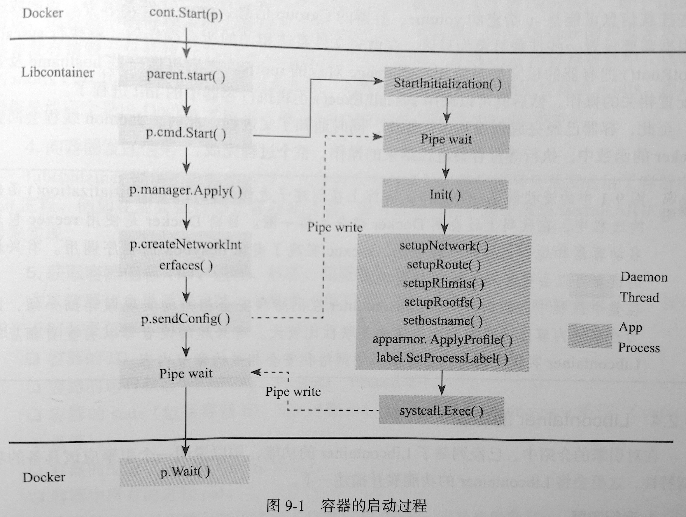

# Docker 和 LXC

LXC目前通常指`Linux Container`，即内核容器。Docker和 LXC简单的说， Docker在内核容器技术（cgroups和namespaces）的基础上，提供了一个更高层层次的控制工具，Docker包括以下特性：

1. 跨主机部署
2. 以应用为中心
3. 自动构建
4. 版本管理
5. 组建重用
6. 共享仓库
7. 工具生态

虚拟机是用来进行硬件资源划分的解决方案，它利用了硬件的虚拟化技术，例如 VT-x， AMD-V或者privilege level（权限等级）会同时通过一个hypervisor来实现资源的彻底隔离；而容器的操作系统级别的虚拟化，利用的是内核的Cgroup和namespace特性。

## LXC

## Docker

Docker容器和主机共享内核，不同容器之间可以共享部分系统资源，因此容器更加轻量级，消耗的资源也更少。

Docker容器的启动流程如下

### Libcontainer

项目地址： [https://github.com/opencontainers/runc/tree/master/libcontainer](https://github.com/opencontainers/runc/tree/master/libcontainer)

Libcontainer 是Docker中用于容器管理的包，它基于Go语言实现，通过管理namespaces、cgroups、capabilities以及文件系统来进行容器控制。你可以使用Libcontainer创建容器，并对容器进行生命周期管理。

Libcontainer功能：
1. 运行容器
2. 暂停/恢复容器（这一特性是通过cgroup中的freezer子系统来实现的）
3. 销毁容器
4. 向容器发送信号
5. 获取容器的信息
6. 修改容器的配置
7. Checkpoint/Restore容器

