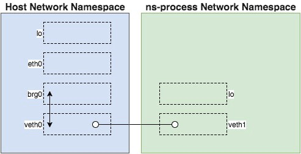

# 命名空间Go实现 - Network
在前面的文章中我们看到了如何使用`chroot`和Mount命名空间为`container`切换root文件系统。虽然它现在还是只单个 `/bin/sh` 进程，但是它却有一下这些非常好的特性：

1. 可以以非root身份运行 - User 命名空间
2. 可以选择root文件系统 - Mount 命名空间
3. 不能看到宿主机的进程 - PID 命名空间

但是还有一块很重要的功能缺失了 - 网络。现在 `container` 没有连接任何网络。

```bash
# Git repo: https://github.com/bingbig/container
# Git tag: 2.0
# Filename: container.go

$ ./container run /bin/sh
-[container]- # route
Kernel IP routing table
Destination     Gateway         Genmask         Flags Metric Ref    Use Iface
-[container]- # ping 8.8.8.8
PING 8.8.8.8 (8.8.8.8): 56 data bytes
ping: sendto: Network unreachable
```

缺少连接的原因是`container` 克隆了一个新的Network命名空间。在本文我们将会配置新的Network命名空间。

## 关于网络
如果我们想要给`container` 配置网络连接，对网络命名空间的了解至关重要。我建议你去读一读 [Introducing Linux Network Namespaces](http://blog.scottlowe.org/2013/09/04/introducing-linux-network-namespaces/)。这篇文章中的知识和是想会帮助你理解Network命名空间配置的基础。简而言之，我们需要做以下的内容：

1. 在宿主机Network命名空间创建一个桥接设备
2. 创建一个[veth pair](https://www.cnblogs.com/bakari/p/10613710.html)
3. 将veth pair的一端连接到桥
4. 将veth pair的另一端放到Network命名空间里
5. 确保命名空间里进程的所有的外出流量都通过veth流出

最基本的思想就是在`container` Network命名空间和宿主机的Network命名空间之间建立连接。可视化这个过程如下图：



这实际上需要大量的工作！在两个不同的Network命名空间里初始化和配置网络是得过程更加复杂。而且更麻烦的是初始化网络需要root权限。这意味着 `container` 将失去以非root身份运行的特性了。

幸运的是通过使用`setuid`我们可以避免这些麻烦事。`setuid` 允许一个进程以拥有它的用户身份去运行。据此，我们可以把网络初始化代码分离独立成一个可执行文件，并且确保这个可执行文件的所有者是root用户，同时对应用 `setuid` 权限。接着我们可以在 `container`（以非root用户身份运行）内部去调用这个可执行文件。记住这些，我再来介绍`netsetgo`。

## netset, Go!
[`netsetgo`](https://github.com/teddyking/netsetgo) 可以为容器初始化Network命名空间的程序。它实现了上面所说的内容。为了简洁我不会把它所有的代码复制到这里，但是我们简要的指出其中最重要的部分，你可以自己去看看细节。

1. 桥的通过调用`netlink.Linkadd` 创建, 在[这里](https://github.com/teddyking/netsetgo/blob/0.0.1/device/bridge.go#L15-L37)
2. Veth的创建是通过另外一次`netlink.Linkadd`调用创建，在[这里](https://github.com/teddyking/netsetgo/blob/0.0.1/device/veth.go#L16-L41)
3. 通过调用`netlink.LinkSetMaster` 将veth连接到桥，在[这里](https://github.com/teddyking/netsetgo/blob/0.0.1/device/bridge.go#L39-L51)
4. 通过调用 `netlink.LinkSetNsPid` 将veth移动到新的网络空间，在[这里](https://github.com/teddyking/netsetgo/blob/0.0.1/device/veth.go#L43-L50)
5. 通过调用 `netlink.RouteAdd` 将默认的路由加到新的网络空间里，在[这里](https://github.com/teddyking/netsetgo/blob/0.0.1/configurer/container.go#L47-L53)

为了能在`container`中使用`netsetgo`， 我们需要把可执行文件下载下来并设置权限，如下：

```bash
# Git repo: https://github.com/teddyking/container
# Git tag: 4.1
$ wget "https://github.com/teddyking/netsetgo/releases/download/0.0.1/netsetgo"
$ mv netsetgo /usr/local/bin/
$ chown root:root /usr/local/bin/netsetgo
$ chmod 4755 /usr/local/bin/netsetgo # 4 表示其他用户执行文件时，具有与所有者相当的权限
```
`chmod 4755` 中的 `4` 表示 `setuid` 位应该被设置。

## Let's Go
现在`netsetgo`已经就位，我们需要修改`container`，让它可以执行`netsetgo`来配置网络。简单的想法就是我们创建一个`*exec.Cmd`执行这个`netsetgo`然后在适当的时机运行它？

当然没有比这看起来更容易的事了，但是什么时候执行`netsetgo`还需要其他的考虑。我们先回顾一下当前命名空间是怎么创建的：

```go
# Git repo: https://github.com/bingbig/container
# Git tag: 4.0
# Filename: container.go
# ...
func run() {
	cmd := reexec.Command(append([]string{"nsInitialisation"},
		os.Args[2:]...)...)
	# ...

	if err := cmd.Run(); err != nil {
		fmt.Printf("Error running the reexec.Command - %s\n", err)
		os.Exit(1)
	}
}
```

`reexec` 配置了一系列的 `CLONE_NEW*` flag位，并且通过`cmd.Run`执行。注意`cmd.Run`在进程结束前不会返回。到目前为止，通过`nsInitialisation`方法我们在新的命名空间创建之前就配置好所有的后续命名空间配置。但是，`netsetgo` 需要配置新的命名空间的同时也配置宿主机的Network命名空间，这就意味着我们不能依赖阻塞调用`cmd.Run()`了。

幸运的是，`cmd.Run()`可以被分成连个分离的调用： `cmd.Start()`（立即返回）和`cmd.Wait()`（阻塞知道执行的命令结束）。这正式我们需要的，我们可以在新的命名空间创建之后执行`netsetgo`，同时还得在宿主机命名空间运行。我们在实例中看看。

```go
# Git repo: https://github.com/bingbig/container
# Git tag: 5.0
# Filename: container.go
# ...
if err := cmd.Start(); err != nil {
		fmt.Printf("Error starting the reexec.Command - %s\n", err)
		os.Exit(1)
	}

pid := fmt.Sprintf("%d", cmd.Process.Pid)
netsetgoCmd := exec.Command("/usr/local/bin/netsetgo", "-pid", pid)
if err := netsetgoCmd.Run(); err != nil {
	fmt.Printf("Error running netsetgo - %s\n", err)
	os.Exit(1)
}

if err := cmd.Wait(); err != nil {
	fmt.Printf("Error running the reexec.Command - %s\n", err)
	os.Exit(1)
}
```

这个改动可以让`netsetgo`跨越两个Network命名空间配置网络。剩下就是确保在这个命名空间网络准备就绪前`/bin/sh`不会被启动。

我们可以认为新Network命名空间里的veth接口的出现是网络准备就绪的证据。我们可以简单的设置一个循环来判断。

```go
# Git repo: https://github.com/bingbig/container
# Git tag: 5.0
# Filename: container.go
# ...
func waitForNetwork() error {
	maxWait := time.Second * 3
	checkInterval := time.Second
	timeStarted := time.Now()

	for {
		interfaces, err := net.Interfaces()
		if err != nil {
			return err
		}

		// pretty basic check ...
		// > 1 as a lo device will already exist
		if len(interfaces) > 1 {
			return nil
		}

		if time.Since(timeStarted) > maxWait {
			return fmt.Errorf("Timeout after %s waiting for network", maxWait)
		}

		time.Sleep(checkInterval)
	}
}
```

这样我们就可以通过简单的循环来判断网络接口是否就绪了。最后，我们更新`nsInitialisation`方法来调用上面的方法。

```go{10-13}
# Git repo: https://github.com/bingbig/container
# Git tag: 5.0
# Filename: container.go
# ...
func nsInitialisation() {
	fmt.Printf("\n>> namespace setup code goes here <<\n\n")

	setMount("/root/containerFS")

	if err := waitForNetwork(); err != nil {
		fmt.Printf("Error waiting for network - %s\n", err)
		os.Exit(1)
	}

	nsRun()
}
```

我们来执行一下！

```bash
# Git repo: https://github.com/bingbig/container
# Git tag: 5.0
# Filename: container.go
$ go build
$ ./container run /bin/sh
-[container]- # ifconfig
veth1     Link encap:Ethernet  HWaddr 06:A1:78:C3:FC:1B
          inet addr:10.10.10.2  Bcast:0.0.0.0  Mask:255.255.255.0
          inet6 addr: fe80::4a1:78ff:fec3:fc1b/64 Scope:Link
          UP BROADCAST RUNNING MULTICAST  MTU:1500  Metric:1
          RX packets:6 errors:0 dropped:0 overruns:0 frame:0
          TX packets:22 errors:0 dropped:0 overruns:0 carrier:0
          collisions:0 txqueuelen:1000
          RX bytes:420 (420.0 B)  TX bytes:1698 (1.6 KiB)

-[container]- # route
Kernel IP routing table
Destination     Gateway         Genmask         Flags Metric Ref    Use Iface
default         10.10.10.1      0.0.0.0         UG    0      0        0 veth1
10.10.10.0      *               255.255.255.0   U     0      0        0 veth1
-[container]- # ping 10.10.10.1 -c 2
PING 10.10.10.1 (10.10.10.1): 56 data bytes
64 bytes from 10.10.10.1: seq=0 ttl=64 time=0.121 ms
64 bytes from 10.10.10.1: seq=1 ttl=64 time=0.089 ms

--- 10.10.10.1 ping statistics ---
2 packets transmitted, 2 packets received, 0% packet loss
round-trip min/avg/max = 0.089/0.105/0.121 ms
```

很好，我们有一个`veth1`网络接口，IP地址是10.10.10.2。

## 连接互联网

为`container`开启互联网连接有一点点超出本文的范围。网络连接的失败有很多原因，尝试覆盖所有的环境变量的初始化非常困难。

下面的步骤可以在我的Ubuntu16.04 Xenial机器上开启互联网连接。我不能保证对你的环境有效，如果感兴趣可以自己去研究。

首先我们需要在宿主机上配置以下iptales规则：
```bash
# Git repo: https://github.com/teddyking/ns-process
# Git tag: 5.0
$ sudo iptables -tnat -N netsetgo
$ sudo iptables -tnat -A PREROUTING -m addrtype --dst-type LOCAL -j netsetgo
$ sudo iptables -tnat -A OUTPUT ! -d 127.0.0.0/8 -m addrtype --dst-type LOCAL -j netsetgo
$ sudo iptables -tnat -A POSTROUTING -s 10.10.10.0/24 ! -o brg0 -j MASQUERADE
$ sudo iptables -tnat -A netsetgo -i brg0 -j RETURN
```

然后在新的命名空间添加一个DNS服务器。

```bash
# Git repo: https://github.com/bingbig/container
# Git tag: 5.0
# Filename: container.go
$ go build
$ ./container
-[container]- # echo "nameserver 8.8.8.8" >> /etc/resolv.conf
-[container]- # ping google.com
PING google.com (172.217.23.14): 56 data bytes
64 bytes from 172.217.23.14: seq=0 ttl=51 time=4.766 ms
```
然后成功了！`container`可以连接互联网了。

## 下一步
到此为止，`container`已经配置好User，Mount，Pid和Network命名空间了，但是剩下的命名空间我们还需要做什么呢？


