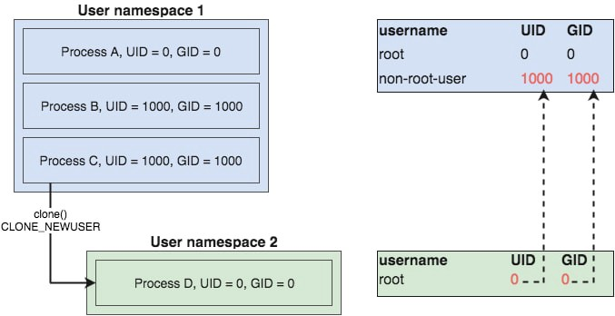

# 命名空间Go实现 - User

在前面的文章中我们知道了如何用Go实现在不同命名空间运行的程序了。

我们在`container`中加了User命名空间，这样我们就不再需要以root身份执行了。这个特性意味着`container`可以变得更加安全。关于User命名空间我们可以比较一下加了User命名空间前后`whoami`的输出。

```bash
# Git repo: https://github.com/bingbig/container
# Git tag: 1.0
# 加入 User namespace 前
$ go build
$ ./container run /bin/sh
-[container]- # whoami
root
-[container]- # id root
uid=0(root) gid=0(root) groups=0(root)
# Git tag: 1.1
$ go build
$ ./container run /bin/sh
-[container]- # whoami
nobody
-[container]- # id nobody
uid=65534(nobody) gid=65534(nogroup) groups=65534(nogroup)
```

虽然我们现在可以以非root用户身份执行`container`， 但是一定进如新的命名空间shell，我们会丢失root身份。


本文我们将解决这个问题。我们先了解更多关于User命名空间的知识。

## UID和GID映射
我们失去身份的原因是我们缺失了一下非常重要的配置。简单的加上`CLONE_NEWUSER` flag是不足以去使用User命名空间的。在合理的设置命名空间之前，我们先得了解UID和GID映射。

ID映射和它和User命名空间的关系是一个复杂的话题。但是为了解决我们当前的问题，这里你需要知道的是：

- User命名空间提供了UID和GID的隔离
- 在同一个主机上，在任意时间都可能会有多个不同的User命名空间在使用中
- 每个linux进程都运行在其中一个User命名空间中
- User命名空间允许User命名空间1中的进程UID和User命名空间2中的进程UID一样
- UID/GID 映射提供了两个不同User命名空间ID映射的机制

举个图来说明这些：



图中有两个User命名空间，1和2， 还有一个相应的UID和GID表。我们可以看到，进程C是以非root身份运行的，它可以克隆出进程D，进程D是以root身份运行的。图中的虚线就是两个User命名空间的映射。

进程D只有在User命名空间2中才会有root权限。从User命名空间1看来，进程D是以非root身份运行的，并没有全部的root权限。

`container`当前就是缺失这个映射，我们来解决这个问题。

## Let's Go

通过设置`cmd.SysProcAttr`的`UidMappings`和`GidMappings`字段可以来应用ID映射。这两个字段都是`syscall.SysProcIDMap`类型。

```go
type SysProcIDMap struct {
        ContainerID int // Container ID.
        HostID      int // Host ID.
        Size        int // Size.
}
```

顾名思义，`ContainerID` 和 `HostID` 就是容器ID和主机ID。`Size` 定义了IDs映射的范围大小，我们可以一次映射多个ID。在我们程序中加入一些映射：

```go
# Git repo: https://github.com/bingbig/container
# Git tag: 2.0
# Filename: container.go
# ...
cmd.SysProcAttr = &syscall.SysProcAttr{
		Cloneflags: syscall.CLONE_NEWNS |
			syscall.CLONE_NEWUTS |
			syscall.CLONE_NEWIPC |
			syscall.CLONE_NEWPID |
			syscall.CLONE_NEWNET |
			syscall.CLONE_NEWUSER,
		UidMappings: []syscall.SysProcIDMap{
			{
				ContainerID: 0,
				HostID:      os.Getuid(),
				Size:        1,
			},
		},
		GidMappings: []syscall.SysProcIDMap{
			{
				ContainerID: 0,
				HostID:      os.Getgid(),
				Size:        1,
			},
		},
	}
# ...
```

上面我们加入了单个UID和GID映射。我们将容器ID设置为0，主机ID设置为当前用户的UID/GID。这样，我们执行`container`命名后，在新的User命名空间运行的用户ID就是0了。

```
$ go build
$ ./container run /bin/sh
-[container]- # whoami
root
-[container]- # id
uid=0(root) gid=0(root) groups=0(root)
```

通过简单的配置我们又可以在新的命名空间shell内核里拥有root身份了，同时也保留了以非root用户运行的能力。

## 接下来
接下来我们讨论`reexec`。什么是`reexec`，它和命名空间的Go实现有什么关系呢？


