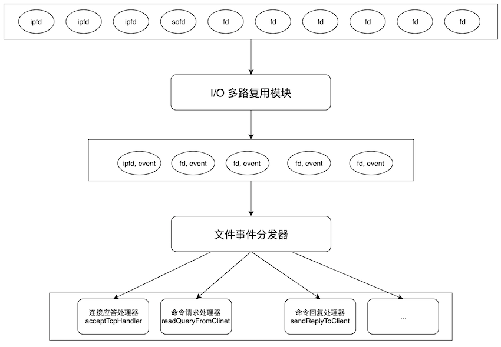

# Redis事件驱动
Redis 是一个事件驱动的内存数据库，依托操作系统的 `I/O 多路复用`技术。服务器需要处理两种类型的事件：文件事件和时间事件。
- 文件事件

Redis 服务器通过 `socket` 实现与客户端（或其他redis服务器）的交互，文件事件就是服务器对 `socket` 操作的抽象。Redis 服务器通过监听这些 `socket` 产生的文件事件并处理这些事件，实现对客户端调用的响应。

- 时间事件

Redis 有很多操作需要在给定的时间点进行处理，时间事件就是对这类定时任务的抽象。

## 1. Reactor
Redis 基于 Reactor 模式开发了自己的事件处理器。



“I/O 多路复用模块”会监听多个描述符，当这些`fd`产生`accept`，`read`，`write` 或 `close` 的文件事件时，“I/O 多路复用模块”会记录发生文件事件的描述符和事件类型。文件事件分发器遍历“I/O 多路复用模块”收集的事件，会根据事件的类型将事件分发给对应的处理器(handler)处理。

Redis具体是怎么实现这种模式的呢？我们先看看事件相关的数据结构。

### 1.1 事件驱动数据结构
Redis 的主函数调用 `initServer()` 函数从而初始化事件循环中心（EventLoop），其结构如下：
```c
/* 事件轮询结构体 */
typedef struct aeEventLoop {
    int maxfd;                          /* 目前已注册的最大描述符 */
    int setsize;                        /* 目前已追踪的最大描述符 */
    long long timeEventNextId;          /* 用于生成时间事件 id */
    time_t lastTime;                    /* 最后一次执行时间事件的时间 */
    aeFileEvent *events;                /* 已注册的文件事件 */
    aeFiredEvent *fired;                /* 已就绪的文件事件 */
    aeTimeEvent *timeEventHead;         /* 时间事件表头，新的时间事件加入到时间事件链表的表头 */
    int stop;                           /* 事件循环的开关 */
    void *apidata;                      /* 多路复用库的私有数据 */
    aeBeforeSleepProc *beforesleep;     /* 在处理事件前要执行的函数 */
    aeBeforeSleepProc *aftersleep;      /* 在处理事件后要执行的函数 */
} aeEventLoop;
```
在事件轮询结构体中，维护了三个重要的成员`events`、`fired`和`timeEventHead`。事件轮询结构体通过`aeCreateEventLoop`函数创建的。
```c
aeEventLoop *aeCreateEventLoop(int setsize) {
    aeEventLoop *eventLoop;
    // ...
    eventLoop->events = zmalloc(sizeof(aeFileEvent)*setsize);
    eventLoop->fired = zmalloc(sizeof(aeFiredEvent)*setsize);
    if (eventLoop->events == NULL || eventLoop->fired == NULL) goto err;
    // ...
    eventLoop->timeEventHead = NULL;
    eventLoop->timeEventNextId = 0;
    // ...
}
```

我们可以看到，`events`和`fired`是文件事件结构体和已触发事件结构体的数组，其元素数目相同，这两个数组的元素数据结构定义如下：
```c
/* 文件事件结构体 */
typedef struct aeFileEvent {
    int mask;                           /* 监听事件类型掩码，值可以 AE_(READABLE|WRITABLE|BARRIER) */
    aeFileProc *rfileProc;              /* 读事件处理器 */
    aeFileProc *wfileProc;              /* 写事件处理器 */
    void *clientData;                   /* 多路复用库的私有数据 */
} aeFileEvent;

/* 触发的事件  */
typedef struct aeFiredEvent {
    int fd;                             /* 已就绪文件描述符 */
    int mask;                           /* 事件类型掩码，值可以是 AE_READABLE 或 AE_WRITABLE，或者是两者的或 */
} aeFiredEvent;
```

## 2. I/O 多路复用模块
Redis 的 I/O 多路复用模块，其实是封装了操作系统提供的`select`，`epoll`，`avport` 和 `kqueue` 这些基础函数。向上层提供了一个统一的接口，屏蔽了底层实现的细节。以epoll为例，封装的接口如下：
```c
// 事件状态
typedef struct aeApiState {
    int epfd; // epoll_event 实例描述符
    struct epoll_event *events; // 事件槽
} aeApiState;

// 创建一个新的 epoll 
static int aeApiCreate(aeEventLoop *eventLoop)
// 调整事件槽的大小
static int aeApiResize(aeEventLoop *eventLoop, int setsize)
// 释放 epoll 实例和事件槽
static void aeApiFree(aeEventLoop *eventLoop)
// 关联给定事件到 fd
static int aeApiAddEvent(aeEventLoop *eventLoop, int fd, int mask)
// 从 fd 中删除给定事件
static void aeApiDelEvent(aeEventLoop *eventLoop, int fd, int mask)
// 获取可执行事件
static int aeApiPoll(aeEventLoop *eventLoop, struct timeval *tvp)
```
在redis启动时，I/O 多路复用模块是在`initServer`函数中初始化的。之后Redis将监听套接字和Unix域套接字的可读事件加入到`aeEventLoop.events`数组中（描述符为数组索引），分别指定读处理器`acceptTcpHandler`和`acceptUnixHandler`，并调用`aeApiAddEvent`将套接字描述符加入到轮询中，监听这些描述符的可读事件。

```c
// 初始化I/O 多路复用模块和事件轮询结构体
initServer() -> aeCreateEventLoop() -> aeApiCreate()

// 将监听套接字相关信息加入轮询结构体中，并监听这些描述符的可读事件
(listenToPort(), anetUnixServer())-> aeCreateFileEvent()->aeApiAddEvent()
```

## 3. 事件分发器（dispatcher）
Redis 的事件分发器 `ae.c/aeProcessEvents` 不但处理文件事件还处理时间事件。事件分发器根据`aeFiredEvent.mask`调用不同的事件处理器。
Redis的事件分发器由`aeMain`函数循环调用。事件分发过程如下：
1. 从头遍历双向链表`aeEventLoop.timeEventHead`，计算出最近一次时间时间发生还有多久，假设还需要time秒；
2. 调用I/O复用模块阻塞并等待文件事件的产生，最大阻塞时间为time秒，如果等待时间事件触发时间为0，`aeApiPoll`立即返回，不阻塞。如果期间有retval个文件事件的发生，则更新`aeEventLoop.fired`数组的前retval个元素的`fd`和`mask`；
3. 处理到达的文件事件。读取`aeEventLoop.fired`数组的前retval个元素，根据`fd`和`mask`从`aeEventLoop.events`调用描述符相应的不同的事件处理器；
4. 处理时间事件。

```c
// 循环调用aeProcessEvents事件分发器
aeMain()
        ->aeProcessEvents()                                     
            // 计算离最近一次时间事件发生还有多久，记为timeval
            ->aeSearchNearestTimer()                
                // 阻塞并等待文件事件的产生，最大阻塞时间为timeval，
                // 如果等待时间事件触发时间为0，aeApiPoll立即返回，不阻塞
                ->aeApiPoll()
                    // 先处理文件事件
                    ->ProcessFileEvents
                    // 后处理时间事件
                    ->processTimeEvents()
                        // 可读事件，调用读事件处理器
                        ->if(AE_READABLE)->*rfileProc()
                        // 可写事件，调用写事件处理器
                        ->if(AE_WRITABLE)->*wfileProc()
```

## 4. 文件事件处理器
Redis 有大量的事件处理器类型，我们就讲解处理一个简单命令涉及到的三个处理器：

#### `acceptTcpHandler` 连接应答处理器
负责处理连接相关的事件，当有client 连接到Redis的时候们就会产生 `AE_READABLE` 事件。引发它执行。`acceptTcpHandler`会`accept`客户端连接，为客户端创建客户端状态（`redisClient`)，当`fd`不为 -1 时，绑定读事件到事件 `loop` （开始接收命令请求）。

#### `readQueryFromClinet` 命令请求处理器
负责读取通过 sokect 发送来的命令。

#### `sendReplyToClient` 命令回复处理器
当Redis处理完命令，就会产生 AE_WRITEABLE 事件，将数据回复给 client。

## 5. 时间事件处理
时间事件结构体是一个按照`id`倒序排列的链表，并没有按照时间顺序排序。
```c
/* 时间事件结构体 */
typedef struct aeTimeEvent {
    long long id;                       /* 时间事件的唯一标识符 */
    long when_sec;                      /* 事件的到达时间 */
    long when_ms;
    aeTimeProc *timeProc;               /* 事件处理函数 */
    aeEventFinalizerProc *finalizerProc;        /* 事件释放函数 */
    void *clientData;                   /* 多路复用库的私有数据 */
    struct aeTimeEvent *prev;           /* 指向上个时间事件结构，形成链表 */
    struct aeTimeEvent *next;           /* 指向下个时间事件结构，形成链表 */
} aeTimeEvent;
```
Redis 使用`processTimeEvent`函数处理所有的时间事件，我们整理一下执行思路：
1. 处理系统时间被修改产生的问题（如果之前系统时间提前了，后来又修改了，则立即执行所有的时间事件）。
2. 遍历链表找出所有 `when_sec` 和 `when_ms` 小于现在时间的事件；
3. 执行事件对应的处理函数；
4. 检查事件类型，如果是周期事件则刷新该事件下一次的执行事件，否则删除。


## 参考
- [Redis 事件驱动详解](http://wiki.jikexueyuan.com/project/redis/event-driven.html)
- [Redis 中的事件驱动模型](https://xilidou.com/2018/03/22/redis-event/)