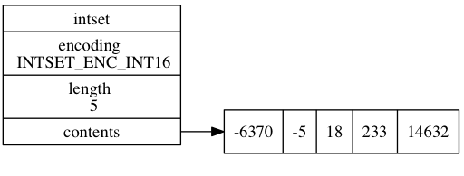
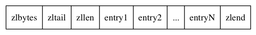

# 数据结构和对象

## 简单动态字符串
Redis没有直接使用C里面的字符串，而是构建了一种名为简单动态字符串(Simple dynamic strings, SDS)的抽象类型，并且作为Redis的默认字符串表示。
> 相关源文件： [sds.c](https://github.com/antirez/redis/blob/5.0/src/sds.c), [sds.h](https://github.com/antirez/redis/blob/5.0/src/sds.h), [sdsalloc.h](https://github.com/antirez/redis/blob/5.0/src/sdsalloc.h), [zmalloc.c](https://github.com/antirez/redis/blob/5.0/src/zmalloc.c), [zmalloc.h](https://github.com/antirez/redis/blob/5.0/src/zmalloc.h)

### 数据结构
`sdsalloc.h`很简单，只是引入了SDS的内存管理模块而已（源码如下）。而真正的内存管理是在`zmalloc.h`和`zmalloc.c`中定义和实现的，具体实现请看[这里](./zmalloc.md)。
```c
#include "zmalloc.h"
#define s_malloc zmalloc
#define s_realloc zrealloc
#define s_free zfree
```
简单动态字符串具体是在`sds.c`和`sds.h`中实现的。在头文件中定义了两种主要的类型，`sds`和`sdshdr##T`。

```c
typedef char *sds;

/* Note: sdshdr5 is never used, we just access the flags byte directly.
 * However is here to document the layout of type 5 SDS strings. */
struct __attribute__ ((__packed__)) sdshdr5 {
    /* __attribute__ ((__packed__)) 取消字节对齐*/
    unsigned char flags; /* 3 lsb of type, and 5 msb of string length */
    char buf[];
};
struct __attribute__ ((__packed__)) sdshdr8 {
    uint8_t len; /* used */
    uint8_t alloc; /* excluding the header and null terminator */
    unsigned char flags; /* 3 lsb of type, 5 unused bits */
    char buf[];
};
struct __attribute__ ((__packed__)) sdshdr16 {
    uint16_t len; /* used */
    uint16_t alloc; /* excluding the header and null terminator */
    unsigned char flags; /* 3 lsb of type, 5 unused bits */
    char buf[];
};
struct __attribute__ ((__packed__)) sdshdr32 {
    uint32_t len; /* used */
    uint32_t alloc; /* excluding the header and null terminator */
    unsigned char flags; /* 3 lsb of type, 5 unused bits */
    char buf[];
};
struct __attribute__ ((__packed__)) sdshdr64 {
    uint64_t len; /* used */
    uint64_t alloc; /* excluding the header and null terminator */
    unsigned char flags; /* 3 lsb of type, 5 unused bits */
    char buf[];
};
```
作者共定义了五种类型的`sdshdr`，主要是为了内存的优化，节省内存，毕竟sds是redis中最常用到的数据类型。`__attribute__ ((__packed__))` 也是为了告诉编译器取消字节对齐优化。其中`sdshdr5`还没有使用过。

整个SDS的内存是一块连续的，统一开辟的。`sdshdr`结构体后面紧跟着字符串`sds`。结构体的最后一个成员`char buf[];`是一个元素个数为0的字符数组，并不占用内存空间，为了指示在结构体后面才是字符串的实体所在。所以在`sds.h`中就有这么些骚操作：

### SDS数据操作
1. sds和sdshdr
```c
// 根据字符串sds拿到sdshdr结构体的指针。
//    字符串sds减去相应结构体的大小得到结构体
#define SDS_HDR_VAR(T,s) struct sdshdr##T *sh = (void*)((s)-(sizeof(struct sdshdr##T)));
// 根据字符串sds拿到sdshdr结构体的地址
#define SDS_HDR(T,s) ((struct sdshdr##T *)((s)-(sizeof(struct sdshdr##T))))
```

2. sds和flags
```c{6}
static inline size_t sdslen(const sds s) {
    /*
     * inline关键字仅仅是建议编译器做内联展开处理，而不是强制。在gcc编译器中，如果编译优化设置为-O0，即使是inline函数也不会被内联展开，
     * 除非设置了强制内联（__attribute__((always_inline))）属性。
     * */
    unsigned char flags = s[-1];
    switch(flags&SDS_TYPE_MASK) {
        case SDS_TYPE_5:
            return SDS_TYPE_5_LEN(flags);
        case SDS_TYPE_8:
            return SDS_HDR(8,s)->len;
        case SDS_TYPE_16:
            return SDS_HDR(16,s)->len;
        case SDS_TYPE_32:
            return SDS_HDR(32,s)->len;
        case SDS_TYPE_64:
            return SDS_HDR(64,s)->len;
    }
    return 0;
}
```
看代码第6行，这就很厉害了，字符串前一个字节就是`flags`，-1 就拿到了类型的值，进而就知道s(sds)前面的sdshdr的地址。

### 创建SDS

先计算C字符串的长度：
```c
sds sdsnew(const char *init) {
    size_t initlen = (init == NULL) ? 0 : strlen(init);
    return sdsnewlen(init, initlen);
}
```
根据长度和字符串创建SDS：
```c
sds sdsnewlen(const void *init, size_t initlen) {
    void *sh;
    sds s;
    char type = sdsReqType(initlen); /* 根据字符串的长度选择合适的sdshdr类型 */
    /* Empty strings are usually created in order to append. Use type 8
     * since type 5 is not good at this. */
    if (type == SDS_TYPE_5 && initlen == 0) type = SDS_TYPE_8;
    int hdrlen = sdsHdrSize(type);
    unsigned char *fp;

    sh = s_malloc(hdrlen+initlen+1);  /* sds结构长度+起始字符串长度+末尾空字符（1）*/
    if (init==SDS_NOINIT)
        init = NULL;
    else if (!init)
        memset(sh, 0, hdrlen+initlen+1);
    if (sh == NULL) return NULL;
    s = (char*)sh+hdrlen; /* 跳到结构体的最后，拿到sds的指针 */
    fp = ((unsigned char*)s)-1; /* 回过头来拿到结构体中flags成员的指针 */
    switch(type) { /* 初始化结构体成员 */
        case SDS_TYPE_5: {
            *fp = type | (initlen << SDS_TYPE_BITS);
            break;
        }
        case SDS_TYPE_8: {
            SDS_HDR_VAR(8,s);
            sh->len = initlen;
            sh->alloc = initlen;
            *fp = type;
            break;
        }
        case SDS_TYPE_16: {
            SDS_HDR_VAR(16,s);
            sh->len = initlen;
            sh->alloc = initlen;
            *fp = type;
            break;
        }
        case SDS_TYPE_32: {
            SDS_HDR_VAR(32,s);
            sh->len = initlen;
            sh->alloc = initlen;
            *fp = type;
            break;
        }
        case SDS_TYPE_64: {
            SDS_HDR_VAR(64,s);
            sh->len = initlen;
            sh->alloc = initlen;
            *fp = type;
            break;
        }
    }
    if (initlen && init)
        memcpy(s, init, initlen); /* 把字符串保存到sds中 */
    s[initlen] = '\0';  /* 加上\0作为字符串结束符 */
    return s;
}
```
就是如此高雅简洁！

### SDS 字符拼接
对字符串进行拼接是常有的操作。`sdscat`和`strcat`有很大的区别。

`sdscat`

```c
sds sdscat(sds s, const char *t) {
    return sdscatlen(s, t, strlen(t));
}
```

`sdscatlen`
```c
sds sdscatlen(sds s, const void *t, size_t len) {
    // 获取当前SDS的长度，sdshdr->len
    size_t curlen = sdslen(s);

    s = sdsMakeRoomFor(s,len);
    if (s == NULL) return NULL;
    // 将目标字符串的内容复制到原SDS后面
    memcpy(s+curlen, t, len);
    // 重新设置sds的长度，即更新sdshdr->len
    sdssetlen(s, curlen+len);
    // sds后面加上'\0'
    s[curlen+len] = '\0';
    return s;
}
```
`sdscatlen`函数的核心是`sdsMakeRoomFor`，它是如何杜绝SDS缓冲区溢出的呢？

```c
sds sdsMakeRoomFor(sds s, size_t addlen) {
    void *sh, *newsh;
    // 计算SDS剩余缓存大小： sdshdr->alloc - sdshdr->len
    size_t avail = sdsavail(s);
    size_t len, newlen;
    char type, oldtype = s[-1] & SDS_TYPE_MASK;
    int hdrlen;

    /* 剩余空间足够addlen长度字符的加入，立即返回 */
    if (avail >= addlen) return s;

    // 当前SDS使用了的长度 sdshdr->len
    len = sdslen(s);
    // 获取SDS的sdshdr结构体的指针
    sh = (char*)s-sdsHdrSize(oldtype);
    newlen = (len+addlen);
    // SDS_MAX_PREALLOC： 字符串最大的预分配长度是1M
    if (newlen < SDS_MAX_PREALLOC)
        newlen *= 2;
    else
        newlen += SDS_MAX_PREALLOC;

    // 根据新的sds字符串的长度重新计算sdshdr的类型
    type = sdsReqType(newlen);

    /* Don't use type 5: the user is appending to the string and type 5 is
     * not able to remember empty space, so sdsMakeRoomFor() must be called
     * at every appending operation. */
    if (type == SDS_TYPE_5) type = SDS_TYPE_8;

    // sdshdr结构体的长度
    hdrlen = sdsHdrSize(type);
    // sdshdr类型没有变，对sdshdr realloc扩容即可
    if (oldtype==type) {
        newsh = s_realloc(sh, hdrlen+newlen+1);
        if (newsh == NULL) return NULL;
        s = (char*)newsh+hdrlen;
    } else {
        /* Since the header size changes, need to move the string forward,
         * and can't use realloc */
        // sdshdr的类型和大小都变了需要创建一个新的sdshdr
        newsh = s_malloc(hdrlen+newlen+1);
        if (newsh == NULL) return NULL;
        // 将s复制到新的sdshdr后面的sds中
        memcpy((char*)newsh+hdrlen, s, len+1);
        // 回收旧的sdshdr
        s_free(sh);
        // 新的sds指针
        s = (char*)newsh+hdrlen;
        // 设置sdshdr的类别
        s[-1] = type;
        // 设置新的sdshdr的长度成员, sdshdr->len
        sdssetlen(s, len);
    }
    sdssetalloc(s, newlen);
    return s;
}
```
描述`sdsMakeRoomFor()`，可以简而言之：原SDS剩余空间够用，直接返回；空间不够，则重新创建一个新的sdshdr，将原SDS复制到新的sdshdr后的SDS中。

关于扩容长度策略：
1. 当修改后SDS字符串长度小于 `SDS_MAX_PREALLOC`（1M）时，扩容长度为修改后字符串长度的两倍。
2. 当修改后的SDS字符串长度大于`SDS_MAX_PREALLOC`时，扩容的长度为修改后字符串长度加上`SDS_MAX_PREALLOC`,即新的字符长度+1m大小。

和`sdsMakeRoomFor()`函数相反，SDS时通过`sdsRemoveFreeSpace()`函数实现惰性空间释放。其原理于前者类似，sdshdr类型不变时，直接`realloc`，类型发生了变化时，创建一个新的sdshdr，将sds复制到新的sdshdr后面，回收旧的sdshdr占用的内存。

### SDS和C字符串的区别
SDS相对于C字符串有以下优势：
1. 常数复杂度获取字符串长度
2. 杜绝缓冲区溢出
3. 减少修改字符串时带来的内存重分配次数
4. 二进制安全
5. 兼容部分C字符串函数，如 `printf("%s", s->buf);`。

### 编译测试
Redis SDS可以作为独立的模块使用。编译测试：

```shell
gcc -DSDS_TEST_MAIN -o sds sds.c zmalloc.c
```

## 链表
作为一种常用数据结构，C 语言并没有内置这种数据结构，所以 Redis 构建了自己的链表实现。
> 相关源文件： [adlist.h](https://github.com/antirez/redis/blob/5.0/src/adlist.h), [adlist.c](https://github.com/antirez/redis/blob/5.0/src/adlist.c), [zmalloc.h](https://github.com/antirez/redis/blob/5.0/src/zmalloc.h) 

Redis的链表是一个双向链表，使用list结构持有链表。
```c
typedef struct listNode {
    struct listNode *prev;
    struct listNode *next;
    void *value;
} listNode;

typedef struct listIter {
    listNode *next;
    int direction;
} listIter;

/* 使用list持有链表 */
typedef struct list {
    // 表头节点
    listNode *head;
    // 表尾节点
    listNode *tail;
    // 链表所包含的节点数量
    unsigned long len;
    // 节点值复制函数
    void *(*dup)(void *ptr);
    // 节点值释放函数
    void (*free)(void *ptr);
    // 节点值对比函数
    int (*match)(void *ptr, void *key);
} list;
```
Redis链表的实现和常规的类似，不同的是，`list`结构体中有定义的三个指针函数成员`dup` 、`free` 和 `match`，用于指定实现多态链表所需的类型特定函数。

### Redis链表的特点
1. 双端无环，带表头指针和表尾指针
2. 链表长度获取时间复杂度O(1)
3. 多态，链表节点使用 `void*` 指针来保存节点值， 并且可以通过 `list` 结构的 `dup` 、 `free` 、 `match` 三个属性为节点值设置类型特定函数， 所以链表可以用于保存各种不同类型的值。

### 编译测试
同样，Redis的链表作为Redis的基本数据结构也可以单独作为模块使用。

## 字典
Redis的字典使用的哈希表作为底层实现的，一个哈希表里面可以有多个哈希表节点，每个节点保存了字典中的一个键值对。
> 相关源文件： [dict.h](https://github.com/antirez/redis/blob/5.0/src/dict.h), [dict.c](https://github.com/antirez/redis/blob/5.0/src/dict.c), [zmalloc.h](https://github.com/antirez/redis/blob/5.0/src/zmalloc.h) , [fmacros.h](https://github.com/antirez/redis/blob/5.0/src/fmacros.h), [sds.c](https://github.com/antirez/redis/blob/5.0/src/sds.h), [siphash.c](https://github.com/antirez/redis/blob/5.0/src/siphash.h)

如下图展示了一个普通状态下Redis的字典结构：


```c
typedef struct dict {           /* 字典的结构 */
    dictType *type;             /* 类型特定函数 */
    void *privdata;             /* 私有数据 */
    dictht ht[2];               /* 二元哈希表 */
    long rehashidx;             /* rehash索引进度，值为-1时表示没有在进行rehash */
    unsigned long iterators;    /* 当前运行的迭代器个数 */
} dict;
```

`ht`成员是一个两个元素的数组，数组中的每个项都是一个`dictht`哈希表，一般情况下，字典使用的是 `ht[0]` 哈希表， `ht[1]` 哈希表只会在对 `ht[0] `哈希表进行 `rehash` 时使用。`rehashidx` 记录着当前字典`rehash`索引进度，值为-1时表示没有在进行`rehash`。判断字典是否在`rehash`的宏定义如下：
```c
#define dictIsRehashing(d) ((d)->rehashidx != -1)
```
Redis的哈希表结构体`dicht`，其结构如下：

```c
typedef struct dictht {         /* 哈希表的结构 */
    dictEntry **table;          /* 哈希表键值对指针数组 */
    unsigned long size;         /* 哈希表的大小 */
    unsigned long sizemask;     /* 哈希表大小掩码，用于计算索引值，总是等于size-1*/
    unsigned long used;         /* 该哈希表已有的节点（键值对）数目 */
} dictht;
```
起始哈希表大小为`DICT_HT_INITIAL_SIZE`（4），`table`成员是`dictEntry`键值对指针的数组，每个元素都是指向`dictEntry`的指针。`sizemask` 用于计算索引值，总是等于size-1，方便通过hash值与sizemask得到索引。
```c
h = dictHashKey(d, de->key) & d->ht[1].sizemask;
```
键值对结构体如下：

```c
typedef struct dictEntry {          /* 保存hash表中的键值对 */
    void *key;                      /* 键 */
    union {                         /* 值 */
        void *val;
        uint64_t u64;
        int64_t s64;
        double d;
    } v;
    struct dictEntry *next;         /* 指向哈希表中哈希值相同的下一个节点，用于解决键冲突问题 */
} dictEntry;
```
看到`next`成员可以证实上图中Redis使用链地址法解决键冲突的问题。

### Rehash
#### 1. 哈希方法
Redis默认使用SipHash作为哈希方法，并封装了两个函数：
```c
uint64_t dictGenHashFunction(const void *key, int len);
uint64_t dictGenCaseHashFunction(const unsigned char *buf, int len);
```
#### 2. 扩容和rehash初始化
当调用`dictReplace()`, `dictAdd()`, `dictAddOrFind()`为字典添加/更新一个新的`dictEntry`时，Redis会调用`dictAddRaw()`。

`dictAddRaw()`方法会调用`_dictKeyIndex()`找到键值对的存放索引，查找索引位置前会先调用`_dictExpandIfNeeded()`判断是否需要对哈希表扩容。

如果字典正在进行rehash，那么就不需要再扩容；如果哈希表是空的，将其扩充到起始大小`DICT_HT_INITIAL_SIZE`（值为4）；如果`键值对的数目/哈希表的大小`大于 `dict_force_resize_ratio`（值为5）时或者键值对的数目大于哈希表的大小并且`dict_can_resize`值为1时就对哈希表扩容。满足这些要求后调用`dictExpand()`为rehash做初始化工作。

```c
/* Expand the hash table if needed */
static int _dictExpandIfNeeded(dict *d)
{
    /* 正在hash中，返回 0 */
    if (dictIsRehashing(d)) return DICT_OK;

    /* 如果哈希表是空的，将其扩充到起始大小 */
    if (d->ht[0].size == 0) return dictExpand(d, DICT_HT_INITIAL_SIZE);

    /* If we reached the 1:1 ratio, and we are allowed to resize the hash
     * table (global setting) or we should avoid it but the ratio between
     * elements/buckets is over the "safe" threshold, we resize doubling
     * the number of buckets.
     *
     * 如果比例达到了1:1，并且我们允许调整哈希表的大小或者 键值对的数目/哈希表的大小 超过了
     * 安全阈值，我们将哈希表的大小调整到键值对数目的两倍
     * */
    if (d->ht[0].used >= d->ht[0].size &&
        (dict_can_resize ||
         d->ht[0].used/d->ht[0].size > dict_force_resize_ratio))
    {
        return dictExpand(d, d->ht[0].used*2);
    }
    return DICT_OK;
}
```

`dictExpand()`函数做了以下工作：
1. 计算扩容大小`realsize`（大于扩容size的最小2<sup>n</sup>）;
2. 初始化`dict`第二个哈希表`ht[1]`，大小为扩容大小`realsize`，`sizemark`为`realsize-1`，`used` 为 0；
3. 将`dict`的`rehashidx`设置为`0`。

```c
/* Expand or create the hash table
 * 对已有hash表扩容或者创建一个新的hash表ht[1] */
int dictExpand(dict *d, unsigned long size)
{
    /* the size is invalid if it is smaller than the number of
     * elements already inside the hash table 
     * 如果正在reharsh，或者size小于元素（键值对）的个数，那么是无效的
     */
    if (dictIsRehashing(d) || d->ht[0].used > size)
        return DICT_ERR; /* 返回的是1 */

    dictht n; /* the new hash table */
    unsigned long realsize = _dictNextPower(size);

    /* Rehashing to the same table size is not useful. */
    if (realsize == d->ht[0].size) return DICT_ERR;

    /* Allocate the new hash table and initialize all pointers to NULL */
    n.size = realsize;
    n.sizemask = realsize-1;
    n.table = zcalloc(realsize*sizeof(dictEntry*));
    n.used = 0;

    /* Is this the first initialization? If so it's not really a rehashing
     * we just set the first hash table so that it can accept keys. */
    if (d->ht[0].table == NULL) {
        d->ht[0] = n;
        return DICT_OK;
    }

    /* Prepare a second hash table for incremental rehashing */
    d->ht[1] = n;
    d->rehashidx = 0;
    return DICT_OK;
}
```

#### 3. rehash 方式
当字典完成初始化工作后才有可能开始rehash，rehash的条件是`rehashidx`是否为-1。为了防止rehash过程持续太久而导致进程处于block的状态，redis采用的是**渐进式的rehash策略**。

redis的rehash有两种策略：

- 定时执行：调用`dictRehashMilliseconds()`执行一毫秒的rehash。在redis的`serverCron`里调用，每次执行1ms的`dictRehash()`，一般redis运行时用的字典结构会采用这种方法rehash，如`redisDb`结构体中的`dict`类型的成员。
- 被动执行：字典调用`dictAddRaw()`,`dictGenericDelete()`，`dicFind()`, `dictGetSomeKeys()`，`dictGetRandomKey()`等函数时，会调用`_dictRehashStep`，迁移buckets中的一个非空bucket（或者跳过100个空的bucket）。

```c
/* Rehash for an amount of time between ms milliseconds and ms+1 milliseconds */
int dictRehashMilliseconds(dict *d, int ms) {
    long long start = timeInMilliseconds();
    int rehashes = 0;

    while(dictRehash(d,100)) {
        rehashes += 100;
        if (timeInMilliseconds()-start > ms) break;
    }
    return rehashes;
}

/* This function performs just a step of rehashing, and only if there are
 * no safe iterators bound to our hash table. When we have iterators in the
 * middle of a rehashing we can't mess with the two hash tables otherwise
 * some element can be missed or duplicated.
 *
 * This function is called by common lookup or update operations in the
 * dictionary so that the hash table automatically migrates from H1 to H2
 * while it is actively used. */
static void _dictRehashStep(dict *d) {
    if (d->iterators == 0) dictRehash(d,1);
}
```

#### 4.rehash 原理
上面两种rehash方式都会调用`dictRehash()`执行rehash，先上代码！
```c
/* Performs N steps of incremental rehashing. Returns 1 if there are still
 * keys to move from the old to the new hash table, otherwise 0 is returned.
 *
 * Note that a rehashing step consists in moving a bucket (that may have more
 * than one key as we use chaining) from the old to the new hash table, however
 * since part of the hash table may be composed of empty spaces, it is not
 * guaranteed that this function will rehash even a single bucket, since it
 * will visit at max N*10 empty buckets in total, otherwise the amount of
 * work it does would be unbound and the function may block for a long time.
 * */
int dictRehash(dict *d, int n) {
    /* 哈希表中会存在大量的空的 buckets，设置最大的数目。否则不可预期结束时间 */
    int empty_visits = n*10; /* Max number of empty buckets to visit. */
    if (!dictIsRehashing(d)) return 0;

    while(n-- && d->ht[0].used != 0) {
        dictEntry *de, *nextde;

        /* Note that rehashidx can't overflow as we are sure there are more
         * elements because ht[0].used != 0 */
        assert(d->ht[0].size > (unsigned long)d->rehashidx);
        while(d->ht[0].table[d->rehashidx] == NULL) { /* 跳过空buckets：如果该table数组该索引是空值，rehashidx加1 */
            d->rehashidx++;
            if (--empty_visits == 0) return 1;
        }
        
        de = d->ht[0].table[d->rehashidx];
        /* Move all the keys in this bucket from the old to the new hash HT */
        while(de) {
            uint64_t h;

            nextde = de->next; /* 之前在同一hash index下的其他键值对重新计算index */
            /* Get the index in the new hash table */
            h = dictHashKey(d, de->key) & d->ht[1].sizemask;
            de->next = d->ht[1].table[h];
            d->ht[1].table[h] = de;
            d->ht[0].used--;
            d->ht[1].used++;
            de = nextde;
        }
        d->ht[0].table[d->rehashidx] = NULL; /* ht[1]的table中该位置清空值 */
        d->rehashidx++;
    }

    /* Check if we already rehashed the whole table...
     * 判断是否整个表以前rehash完成，完成后rehashidx设为-1，原始的ht[0]被ht[1]替代，重新初始化ht[1] */
    if (d->ht[0].used == 0) {
        zfree(d->ht[0].table);
        d->ht[0] = d->ht[1];
        _dictReset(&d->ht[1]);
        d->rehashidx = -1;
        return 0;
    }

    /* More to rehash... */
    return 1;
}
```
rehash过程包括将一个bucket（有可能包含多个key，这些key以链表的形式存储）从旧的哈希表（ht[0]）移动到新的哈希表(ht[1])中。哈希表中会存在大量的空的 buckets，redis设置了跳过空的bucket的最大的数目，否则不可预期结束时间（参数`n`表示rehash的非空bucket)。重新hash后，之后hash的键值对会插入到键值对链表的表头。

当 `d->ht[0].used == 0` 时rehash结束，`rehashidx`重新设置为 -1。

### 字典的基本操作
#### 创建字典

```c
/* Reset a hash table already initialized with ht_init().
 * NOTE: This function should only be called by ht_destroy(). */
static void _dictReset(dictht *ht) /* 初始化dictht表结构 */
{
    ht->table = NULL;
    ht->size = 0;
    ht->sizemask = 0;
    ht->used = 0;
}

/* Create a new hash table */
dict *dictCreate(dictType *type, void *privDataPtr)
{
    dict *d = zmalloc(sizeof(*d));

    _dictInit(d,type,privDataPtr);
    return d;
}

/* 初始化字典结构体 */
int _dictInit(dict *d, dictType *type, void *privDataPtr)
{
    _dictReset(&d->ht[0]);
    _dictReset(&d->ht[1]);
    d->type = type;
    d->privdata = privDataPtr;
    d->rehashidx = -1;
    d->iterators = 0;
    return DICT_OK;
}
```
`dictCreate()`函数创建一个新的字典，并对所有的成员设置了初始值，其中`ht`的两个元素都设置为`NULL`。

#### 插入一个键值对
```dictAdd()```方法用于插入一个键值对。

```c
/* Add an element to the target hash table */
int dictAdd(dict *d, void *key, void *val)
{
    dictEntry *entry = dictAddRaw(d,key,NULL);

    if (!entry) return DICT_ERR;
    dictSetVal(d, entry, val);
    return DICT_OK;
}

/* Low level add or find:
 * This function adds the entry but instead of setting a value returns the
 * dictEntry structure to the user, that will make sure to fill the value
 * field as he wishes.
 *
 * This function is also directly exposed to the user API to be called
 * mainly in order to store non-pointers inside the hash value, example:
 *
 * entry = dictAddRaw(dict,mykey,NULL);
 * if (entry != NULL) dictSetSignedIntegerVal(entry,1000);
 *
 * Return values:
 *
 * If key already exists NULL is returned, and "*existing" is populated
 * with the existing entry if existing is not NULL.
 *
 * If key was added, the hash entry is returned to be manipulated by the caller.
 */
dictEntry *dictAddRaw(dict *d, void *key, dictEntry **existing)
{
    long index;
    dictEntry *entry;
    dictht *ht;

    if (dictIsRehashing(d)) _dictRehashStep(d);

    /* Get the index of the new element, or -1 if
     * the element already exists. */
    if ((index = _dictKeyIndex(d, key, dictHashKey(d,key), existing)) == -1)
        return NULL;

    /* Allocate the memory and store the new entry.
     * Insert the element in top, with the assumption that in a database
     * system it is more likely that recently added entries are accessed
     * more frequently. */
    ht = dictIsRehashing(d) ? &d->ht[1] : &d->ht[0];
    entry = zmalloc(sizeof(*entry));
    /* 新的键值对插入链表的头部 */
    entry->next = ht->table[index];
    ht->table[index] = entry;
    ht->used++;

    /* Set the hash entry fields. */
    dictSetKey(d, entry, key);
    return entry;
}
```
插入一个新的键值对的过程如下：
1. 如果要插入的字典正在rehash，执行一步rehash（调用`_dictRehashStep()`）
2. 如果这个key在字典中存在，插入函数`dictAdd()`直接返回错误`DICT_ERR`；如果不存在，`dictAddRaw()`新建一个`dictEntry`结构体并插入到对应bucket链表的头部，并调用`dictSetKey()`设置`dictEntry`的key的值。其中有一个细节，当字典在rehash时，新的键值对插入到`ht[1].table`中。
3. 如果成功插入了一个新的`dictEntry`，`dictAdd()`调用`dictSetVal()`设置这个键值对的值。

判断key是否在字典中存在并找到索引是通过`_dictKeyIndex()`函数实现的：
```c
/* Returns the index of a free slot that can be populated with
 * a hash entry for the given 'key'.
 * If the key already exists, -1 is returned
 * and the optional output parameter may be filled.
 *
 * Note that if we are in the process of rehashing the hash table, the
 * index is always returned in the context of the second (new) hash table. */
static long _dictKeyIndex(dict *d, const void *key, uint64_t hash, dictEntry **existing)
{
    unsigned long idx, table;
    dictEntry *he;
    if (existing) *existing = NULL; /* 判断existing是否为空指针，如果是则将其指向的值设为NULL */

    /* Expand the hash table if needed */
    if (_dictExpandIfNeeded(d) == DICT_ERR)
        return -1;
    for (table = 0; table <= 1; table++) {
        idx = hash & d->ht[table].sizemask; /* 用hash值与掩码进行与操作得出索引值 */
        /* Search if this slot does not already contain the given key */
        he = d->ht[table].table[idx];   /* 当前索引下的dictEntry */
        while(he) { /* 遍历查找相同key的dictEntry */
            if (key==he->key || dictCompareKeys(d, key, he->key)) {
                if (existing) *existing = he; /* 如果existing不是空指针，将其指向找到的dictEntry */
                return -1;
            }
            he = he->next;
        }
        if (!dictIsRehashing(d)) break; /* 如果没有在rehashing，则遍历ht[1] */
    }
    return idx;
}
```
`existing` 是一个可选的输出参数，如果key存在，该指针指向找到的键值对`dictEntry`。查找的逻辑如下：
1. 在`ht[0].table`中查找存在该key对应的索引
2. 如果相应的bucket不为空时，遍历的bucket中的`DictEntry`链表以查找相同key值的`DictEntry`
3. 如果该字典在rehash中，如果没有找到还需遍历`ht[1].table`
4. 如果找到了，`existing`不为`NULL`时将`existing`指向找到的`DictEntry`，并返回索引；没有找到则返回-1

设置键值对的key和value的值的方法`dictSetKey()`和`dictSetVal()`是宏函数：
```c
#define dictSetKey(d, entry, _key_) do { \
    if ((d)->type->keyDup) \
        (entry)->key = (d)->type->keyDup((d)->privdata, _key_); \
    else \
        (entry)->key = (_key_); \
} while(0)

#define dictSetVal(d, entry, _val_) do { \
    if ((d)->type->valDup) \
        (entry)->v.val = (d)->type->valDup((d)->privdata, _val_); \
    else \
        (entry)->v.val = (_val_); \
} while(0)
```

#### 删除一个键值对
```c
/* Search and remove an element. This is an helper function for
 * dictDelete() and dictUnlink(), please check the top comment
 * of those functions. */
static dictEntry *dictGenericDelete(dict *d, const void *key, int nofree) {
    uint64_t h, idx;
    dictEntry *he, *prevHe;
    int table;

    if (d->ht[0].used == 0 && d->ht[1].used == 0) return NULL;

    if (dictIsRehashing(d)) _dictRehashStep(d);
    h = dictHashKey(d, key);

    for (table = 0; table <= 1; table++) {
        idx = h & d->ht[table].sizemask;
        he = d->ht[table].table[idx];
        prevHe = NULL;
        while(he) {
            if (key==he->key || dictCompareKeys(d, key, he->key)) {
                /* Unlink the element from the list */
                if (prevHe)
                    prevHe->next = he->next;
                else
                    d->ht[table].table[idx] = he->next;
                if (!nofree) {
                    dictFreeKey(d, he);
                    dictFreeVal(d, he);
                    zfree(he);
                }
                d->ht[table].used--;
                return he;
            }
            prevHe = he;
            he = he->next;
        }
        if (!dictIsRehashing(d)) break;
    }
    return NULL; /* not found */
}

/* Remove an element, returning DICT_OK on success or DICT_ERR if the
 * element was not found. */
int dictDelete(dict *ht, const void *key) {
    return dictGenericDelete(ht,key,0) ? DICT_OK : DICT_ERR;
}
```
删除一个键值对的过程比较简单，就是找到相应的key，将从链表中删除这个`DictEntry`并调用`dictFreeKey()`，`dictFreeVal()`和`zfree()`回收内存。同时还要对哈希表的`used`成员执行自减操作。

#### 修改一个键值对的值
实现了上述操作后，修改一个键值对变得简单的多。调用`dictAddRaw()`找到相应的`dictEntry`，设置新的值并回收旧值占用的内存。
```c
/* Add or Overwrite:
 * Add an element, discarding the old value if the key already exists.
 * Return 1 if the key was added from scratch, 0 if there was already an
 * element with such key and dictReplace() just performed a value update
 * operation. */
int dictReplace(dict *d, void *key, void *val)
{
    dictEntry *entry, *existing, auxentry;

    /* Try to add the element. If the key
     * does not exists dictAdd will succeed. */
    entry = dictAddRaw(d,key,&existing);
    if (entry) {
        dictSetVal(d, entry, val);
        return 1;
    }

    /* Set the new value and free the old one. Note that it is important
     * to do that in this order, as the value may just be exactly the same
     * as the previous one. In this context, think to reference counting,
     * you want to increment (set), and then decrement (free), and not the
     * reverse. */
    auxentry = *existing;
    dictSetVal(d, existing, val);
    dictFreeVal(d, &auxentry);
    return 0;
}
```

#### 根据key查找
根据key查找`dictEnty`的方法`dictFind()`类似于前面提到的`_dictKeyIndex()`。
```c
dictEntry *dictFind(dict *d, const void *key)
{
    dictEntry *he;
    uint64_t h, idx, table;

    if (d->ht[0].used + d->ht[1].used == 0) return NULL; /* dict is empty */
    if (dictIsRehashing(d)) _dictRehashStep(d);
    h = dictHashKey(d, key);
    for (table = 0; table <= 1; table++) {
        idx = h & d->ht[table].sizemask;
        he = d->ht[table].table[idx];
        while(he) {
            if (key==he->key || dictCompareKeys(d, key, he->key))
                return he;
            he = he->next;
        }
        if (!dictIsRehashing(d)) return NULL;
    }
    return NULL;
}
```

### 迭代器
当字典中的键值对数量很大时，可能会使用迭代器分配遍历值（`hscan`或者`scan`遍历redis中的所有键）。redis字典的迭代器分为两种，一种是safe迭代器另一种是unsafe迭代器，safe迭代器在迭代的过程中用户可以对该dict进行CURD操作，unsafe迭代器在迭代过程中用户只能对该dict执行迭代操作。

当对字典执行safe迭代时会停止rehash操作以免扰乱迭代器的迭代。
```c
static void _dictRehashStep(dict *d) {
    if (d->iterators == 0) dictRehash(d,1);
}
```

unsafe迭代器在执行迭代过程中不允许对字典进行其他操作，通过计算指纹来判断字典是否发生了变化，若不一致，则结束进程。
```c
/* A fingerprint is a 64 bit number that represents the state of the dictionary
 * at a given time, it's just a few dict properties xored together.
 * When an unsafe iterator is initialized, we get the dict fingerprint, and check
 * the fingerprint again when the iterator is released.
 * If the two fingerprints are different it means that the user of the iterator
 * performed forbidden operations against the dictionary while iterating. */
long long dictFingerprint(dict *d) {
    long long integers[6], hash = 0;
    int j;

    integers[0] = (long) d->ht[0].table;
    integers[1] = d->ht[0].size;
    integers[2] = d->ht[0].used;
    integers[3] = (long) d->ht[1].table;
    integers[4] = d->ht[1].size;
    integers[5] = d->ht[1].used;

    /* We hash N integers by summing every successive integer with the integer
     * hashing of the previous sum. Basically:
     *
     * Result = hash(hash(hash(int1)+int2)+int3) ...
     *
     * This way the same set of integers in a different order will (likely) hash
     * to a different number. */
    for (j = 0; j < 6; j++) {
        hash += integers[j];
        /* For the hashing step we use Tomas Wang's 64 bit integer hash. */
        hash = (~hash) + (hash << 21); // hash = (hash << 21) - hash - 1;
        hash = hash ^ (hash >> 24);
        hash = (hash + (hash << 3)) + (hash << 8); // hash * 265
        hash = hash ^ (hash >> 14);
        hash = (hash + (hash << 2)) + (hash << 4); // hash * 21
        hash = hash ^ (hash >> 28);
        hash = hash + (hash << 31);
    }
    return hash;
}
```

##### dictScan迭代
safe迭代器和unsafe迭代器的前提都是不能rehash，要通过这两种迭代的方式遍历所有节点会停止该dict的被动rehash，阻止了rehash的正常进行。`dictScan()`可以在不停止rehash的前提下遍历到所有dictEntry节点，尽管会有非常小的可能性出现重复的键值对。

```c
/* dictScan() is used to iterate over the elements of a dictionary.
 *
 * Iterating works the following way:
 *
 * 1) Initially you call the function using a cursor (v) value of 0.
 * 2) The function performs one step of the iteration, and returns the
 *    new cursor value you must use in the next call.
 * 3) When the returned cursor is 0, the iteration is complete.
 *
 * The function guarantees all elements present in the
 * dictionary get returned between the start and end of the iteration.
 * However it is possible some elements get returned multiple times.
 *
 * For every element returned, the callback argument 'fn' is
 * called with 'privdata' as first argument and the dictionary entry
 * 'de' as second argument.
 *
 * HOW IT WORKS.
 *
 * The iteration algorithm was designed by Pieter Noordhuis.
 * The main idea is to increment a cursor starting from the higher order
 * bits. That is, instead of incrementing the cursor normally, the bits
 * of the cursor are reversed, then the cursor is incremented, and finally
 * the bits are reversed again.
 *
 * This strategy is needed because the hash table may be resized between
 * iteration calls.
 *
 * dict.c hash tables are always power of two in size, and they
 * use chaining, so the position of an element in a given table is given
 * by computing the bitwise AND between Hash(key) and SIZE-1
 * (where SIZE-1 is always the mask that is equivalent to taking the rest
 *  of the division between the Hash of the key and SIZE).
 *
 * For example if the current hash table size is 16, the mask is
 * (in binary) 1111. The position of a key in the hash table will always be
 * the last four bits of the hash output, and so forth.
 *
 * WHAT HAPPENS IF THE TABLE CHANGES IN SIZE?
 *
 * If the hash table grows, elements can go anywhere in one multiple of
 * the old bucket: for example let's say we already iterated with
 * a 4 bit cursor 1100 (the mask is 1111 because hash table size = 16).
 *
 * If the hash table will be resized to 64 elements, then the new mask will
 * be 111111. The new buckets you obtain by substituting in ??1100
 * with either 0 or 1 can be targeted only by keys we already visited
 * when scanning the bucket 1100 in the smaller hash table.
 *
 * By iterating the higher bits first, because of the inverted counter, the
 * cursor does not need to restart if the table size gets bigger. It will
 * continue iterating using cursors without '1100' at the end, and also
 * without any other combination of the final 4 bits already explored.
 *
 * Similarly when the table size shrinks over time, for example going from
 * 16 to 8, if a combination of the lower three bits (the mask for size 8
 * is 111) were already completely explored, it would not be visited again
 * because we are sure we tried, for example, both 0111 and 1111 (all the
 * variations of the higher bit) so we don't need to test it again.
 *
 * WAIT... YOU HAVE *TWO* TABLES DURING REHASHING!
 *
 * Yes, this is true, but we always iterate the smaller table first, then
 * we test all the expansions of the current cursor into the larger
 * table. For example if the current cursor is 101 and we also have a
 * larger table of size 16, we also test (0)101 and (1)101 inside the larger
 * table. This reduces the problem back to having only one table, where
 * the larger one, if it exists, is just an expansion of the smaller one.
 *
 * LIMITATIONS
 *
 * This iterator is completely stateless, and this is a huge advantage,
 * including no additional memory used.
 *
 * The disadvantages resulting from this design are:
 *
 * 1) It is possible we return elements more than once. However this is usually
 *    easy to deal with in the application level.
 * 2) The iterator must return multiple elements per call, as it needs to always
 *    return all the keys chained in a given bucket, and all the expansions, so
 *    we are sure we don't miss keys moving during rehashing.
 * 3) The reverse cursor is somewhat hard to understand at first, but this
 *    comment is supposed to help.
 */
unsigned long dictScan(dict *d,
                       unsigned long v,
                       dictScanFunction *fn,
                       dictScanBucketFunction* bucketfn,
                       void *privdata)
{
    dictht *t0, *t1;
    const dictEntry *de, *next;
    unsigned long m0, m1;

    if (dictSize(d) == 0) return 0;

    if (!dictIsRehashing(d)) {
        t0 = &(d->ht[0]);
        m0 = t0->sizemask;

        /* Emit entries at cursor */
        if (bucketfn) bucketfn(privdata, &t0->table[v & m0]);
        de = t0->table[v & m0];
        while (de) {
            next = de->next;
            fn(privdata, de);
            de = next;
        }

        /* Set unmasked bits so incrementing the reversed cursor
         * operates on the masked bits */
        v |= ~m0;

        /* Increment the reverse cursor */
        v = rev(v);
        v++;
        v = rev(v);

    } else {
        t0 = &d->ht[0];
        t1 = &d->ht[1];

        /* Make sure t0 is the smaller and t1 is the bigger table */
        if (t0->size > t1->size) {
            t0 = &d->ht[1];
            t1 = &d->ht[0];
        }

        m0 = t0->sizemask;
        m1 = t1->sizemask;

        /* Emit entries at cursor */
        if (bucketfn) bucketfn(privdata, &t0->table[v & m0]);
        de = t0->table[v & m0];
        while (de) {
            next = de->next;
            fn(privdata, de);
            de = next;
        }

        /* Iterate over indices in larger table that are the expansion
         * of the index pointed to by the cursor in the smaller table */
        do {
            /* Emit entries at cursor */
            if (bucketfn) bucketfn(privdata, &t1->table[v & m1]);
            de = t1->table[v & m1];
            while (de) {
                next = de->next;
                fn(privdata, de);
                de = next;
            }

            /* Increment the reverse cursor not covered by the smaller mask.*/
            v |= ~m1;
            v = rev(v);
            v++;
            v = rev(v);

            /* Continue while bits covered by mask difference is non-zero */
        } while (v & (m0 ^ m1));
    }

    return v;
}
```


### 编译测试
Redis字典依赖于SDS，可以通过下面的方法编译测试。

```shell
gcc -DDICT_BENCHMARK_MAIN -o dict dict.c sds.c zmalloc.c siphash.c 
```

## 跳跃表
跳跃表（skiplist）是一种有序链表扩展， 通过在每个节点中维持多个指向其他节点的指针， 来达到快速访问节点的目的。跳跃表的原理可以看这篇[文章](https://www.cnblogs.com/thrillerz/p/4505550.html)。跳跃表支持平均 O(log N) 最坏 O(N) 复杂度的节点查找， 还可以通过顺序性操作来批量处理节点。
> 相关源文件：[server.h](https://github.com/antirez/redis/blob/5.0/src/dict.h), [t_zset.c](https://github.com/antirez/redis/blob/5.0/src/t_zset.c)

Redis的跳跃表的结构定义如下：
```c
/* ZSETs use a specialized version of Skiplists */
typedef struct zskiplistNode {
    sds ele;
    double score;                           /* 分值，跳跃表中的节点按各自的分值从小到大排列 */
    struct zskiplistNode *backward;         /* 后退指针 */
    struct zskiplistLevel {
        struct zskiplistNode *forward;      /* 前进指针 */
        unsigned int span;                  /* 跨度，前进指针所指向节点和当前节点的距离 */
    } level[];                              /* 层 */
} zskiplistNode;

typedef struct zskiplist {
    struct zskiplistNode *header, *tail; /* 跳跃表的头尾指针 */
    unsigned long length;                /* 跳跃表的长度 */
    int level;                           /* 目前跳跃表内，层数最大的那个节点的层数（表头节点不计算在内）*/
} zskiplist;

typedef struct zset {
    dict *dict;
    zskiplist *zsl;
} zset;
```
Redis的`zset`结构体中包含了`dict`和`zskiplist`两个成员，字典可以快速的定位一个member是否存在`zset`中，跳跃表可以快速查得member的排行和分数。结合两者的优势使得性能更优。


示意图如下：


最右边是`zskiplist`结构：
- header ：指向跳跃表的表头节点，表头节点比较特殊，它定义了跳跃表的最大层数，level和legnth的计算都不包含它
- tail ：指向跳跃表的表尾节点
- level ：记录目前跳跃表内，层数最大的那个节点的层数
- length ：记录跳跃表的长度，也即是，跳跃表目前包含节点的数量

`zskiplist`右边是4个`zskiplistNode`结构体，每个结构体都包含四个成员：
- 层（level）：每个层都带有两个属性：前进指针和跨度。前进指针用于访问位于表尾方向的其他节点，而跨度则记录了前进指针所指向节点和当前节点的距离。
- 后退（backward）指针：后退指针在程序从表尾向表头遍历时使用。
- 分值（score）：在跳跃表中，节点按各自所保存的分值从小到大排列。
- 成员对象（obj）：各个节点中的 o1 、 o2 和 o3 是节点所保存的成员对象。

## 整数集合
整数集合是redis用来保存整数集合的结构体。
```c
typedef struct intset {
    uint32_t encoding;  /* 编码方式 */
    uint32_t length;    /* 集合包含的元素数目 */
    int8_t contents[];  /* 保存元素的数组。虽然声明为int8_t类型的数组，但实际上并不保存该类型的值，数组类型取决于encoding属性的值 */
} intset;
```
和之前的`SDSHDR`结构体一样，最后的成员`contents`的元素个数没有定义。`encoding`表示编码方式，`length`表示集合包含的元素数目，`contents`指向真正的数据所在的地址。



上图展示的是一个包含4个整数的集合，集合元素类型是`int16_t`，`contents`数组的大小等于`sizeof(int16_t) * 5 = 16 * 5 = 80`位。


### 整数集合的基本操作
`intsetResize()`函数用来对现有的整数集合升级。

```c
/* Resize the intset */
static intset *intsetResize(intset *is, uint32_t len) {
    uint32_t size = len*intrev32ifbe(is->encoding);
    is = zrealloc(is,sizeof(intset)+size); /*  realloc函数用于修改一个原先已经分配的内存块的大小，可以使一块内存的扩大或缩小。 */
    return is;
}
```
升级集合到新的大小时，先计算升级后的`content`后面的存储空间（编码*元素个数），加上`intset`结构体的大小作为升级后的整数集合大小。当插入一个大值时，需要将整数集合升级到更大的编码，`intsetUpgradeAndAdd()`实现了整数集合的插入升级。 

```c{10,15,16}
/* Upgrades the intset to a larger encoding and inserts the given integer. */
static intset *intsetUpgradeAndAdd(intset *is, int64_t value) {
    uint8_t curenc = intrev32ifbe(is->encoding);
    uint8_t newenc = _intsetValueEncoding(value);
    int length = intrev32ifbe(is->length);
    int prepend = value < 0 ? 1 : 0;

    /* First set new encoding and resize */
    is->encoding = intrev32ifbe(newenc);
    is = intsetResize(is,intrev32ifbe(is->length)+1);

    /* Upgrade back-to-front so we don't overwrite values.
     * Note that the "prepend" variable is used to make sure we have an empty
     * space at either the beginning or the end of the intset. */
    while(length--) /* 从后往前写，这样就不会覆盖数据 */
        _intsetSet(is,length+prepend,_intsetGetEncoded(is,length,curenc));

    /* Set the value at the beginning or the end. */
    if (prepend)
        _intsetSet(is,0,value);
    else
        _intsetSet(is,intrev32ifbe(is->length),value);
    is->length = intrev32ifbe(intrev32ifbe(is->length)+1);
    return is;
}
```

`_intsetValueEncoding()`通过将`value`和`INT32_MIN`,`INT32_MAX`等比较计算出升级后的编码类型，之后调整集合的大小。调整之后需要对当前存储的数值进行类型转换并重写到相应的内存中，`_intsetSet()`方法就是用来根据整数集合的编码类型来写值。redis在对整数集合升级时，采取的是从后往前写的策略，这样先重写的数据不会覆盖还未重写的数据。

从整数集合中删除一个元素比较简单，先判断要删除的元素是不是小于集合类型的最大值，如果是则在整数集合中找到该元素的位置。假设找到要删除的元素的位置是`pos`，redis要做的是将`pos+1`及其后面的元素往前移，这样就是覆盖了`pos`的值，最后对整数集合的大小进行调整`intsetResize()`。

```c{7,14,15}
/* Delete integer from intset */
intset *intsetRemove(intset *is, int64_t value, int *success) {
    uint8_t valenc = _intsetValueEncoding(value);
    uint32_t pos;
    if (success) *success = 0;

    if (valenc <= intrev32ifbe(is->encoding) && intsetSearch(is,value,&pos)) {
        uint32_t len = intrev32ifbe(is->length);

        /* We know we can delete */
        if (success) *success = 1;

        /* Overwrite value with tail and update length */
        if (pos < (len-1)) intsetMoveTail(is,pos+1,pos);
        is = intsetResize(is,len-1);
        is->length = intrev32ifbe(len-1);
    }
    return is;
}
```

整数集合的值是按照从小到大的顺序排列的，因此可以通过二分法来快速查询值的位置。
```c

/* Search for the position of "value". Return 1 when the value was found and
 * sets "pos" to the position of the value within the intset. Return 0 when
 * the value is not present in the intset and sets "pos" to the position
 * where "value" can be inserted. */
static uint8_t intsetSearch(intset *is, int64_t value, uint32_t *pos) {
    int min = 0, max = intrev32ifbe(is->length)-1, mid = -1;
    int64_t cur = -1;

    /* The value can never be found when the set is empty */
    if (intrev32ifbe(is->length) == 0) {
        if (pos) *pos = 0;
        return 0;
    } else {
        /* Check for the case where we know we cannot find the value,
         * but do know the insert position. */
        if (value > _intsetGet(is,max)) {
            if (pos) *pos = intrev32ifbe(is->length);
            return 0;
        } else if (value < _intsetGet(is,0)) {
            if (pos) *pos = 0;
            return 0;
        }
    }

    while(max >= min) {
        mid = ((unsigned int)min + (unsigned int)max) >> 1;
        cur = _intsetGet(is,mid);
        if (value > cur) {
            min = mid+1;
        } else if (value < cur) {
            max = mid-1;
        } else {
            break;
        }
    }

    if (value == cur) {
        if (pos) *pos = mid;
        return 1;
    } else {
        if (pos) *pos = min;
        return 0;
    }
}
```

## 压缩列表
> 相关源文件：[ziplist.h](https://github.com/antirez/redis/blob/5.0/src/ziplist.h), [ziplist.c](https://github.com/antirez/redis/blob/5.0/src/ziplist.c), [zmalloc.c](https://github.com/antirez/redis/blob/5.0/src/zmalloc.c),[zmalloc.h](https://github.com/antirez/redis/blob/5.0/src/zmalloc.h)

当一个列表键只包含少量列表项， 并且每个列表项小整数值，或者长度比较短的字符串时，redis会采用压缩列表来作为列表键的底层实现。当一个哈希键只包含少量键值对， 并且每个键值对的键和值是小整数值， 或者长度比较短的字符串时，redis会采用压缩列表来作为哈希键的底层实现。

压缩列表时redis为了节省内存开发的一种顺序编码的列表。它可以同时存储整数或者字符串，因为每次操作都需要对内存进行重新分配，因此实际的复杂度和内存的使用量相关。

压缩列表的结构如下：


节点结构如下：


每一个节点都记录了上一个节点的长度，因此可以通过节点的`previous_entry_length`属性计算上一个节点的位置。因为这种前后节点的相关性，删除节点和增加节点都会导致连锁更新。连锁更新在最坏情况下需要对压缩列表执行 N 次空间重分配操作， 而每次空间重分配的最坏复杂度为 O(N) ， 所以连锁更新的最坏复杂度为 O(N^2) 。

## 对象
Redis并没有直接使用上述的这几种数据结构来实现它的键值对数据库，而是基于这些数据结构创建了一个对象系统。这个系统包含`字符串对象`、`列表对象`、`哈希对象`、`集合对象`和`有序集合对象`这五种类型的对象，每种对象都用到了至少一种我们前面所介绍的数据结构。
> 相关源文件: [server.h](https://github.com/antirez/redis/blob/5.0/src/server.h), [server.c](https://github.com/antirez/redis/blob/5.0/src/server.c), [object.c](https://github.com/antirez/redis/blob/5.0/src/object.c)

Redis对象的定义是在`server.h`中的，`type`为redis的外部数据结构，即我们常用的redis五种数据类型，`encoding`为redis的内部数据结构实现，包括我们前面讲的数据类型。
```c
typedef struct redisObject {
    unsigned type:4;        /* 对象的类型 */
    unsigned encoding:4;    /* 对象的编码，ptr指向对象的底层实现结构，结构由这个属性决定。
                            * 通过encoding属性来设定对象所使用的编码，而不是特定类型的对象关联一种固定的编码，
                            * 可以极大的提升redis的灵活性和效率。
                            * */
    unsigned lru:LRU_BITS; /* LRU time (relative to global lru_clock) or
                            * LFU data (least significant 8 bits frequency
                            * and most significant 16 bits access time). */
    int refcount;          /* 引用计数 */
    void *ptr;
} robj;
```
redis使用`refcount`来实现内存的回收机制。通过跟踪对象的引用计数信息， 在适当的时候自动释放对象并进行内存回收。`lru`属性记录了对象最后一次被命令程序访问的时间或者是8位的最近访问频率和16位的访问时间。如果服务器打开了 `maxmemory` 选项， 并且服务器用于回收内存的算法为 `volatile-lru` 或者 `allkeys-lru` ， 那么当服务器占用的内存数超过了 `maxmemory` 选项所设置的上限值时， 空转时长较高的那部分键会优先被服务器释放， 从而回收内存。

- LRU: least recently used,最近最少使用
- LFU: Least Frequently Used,算法根据数据的历史访问频率来淘汰数据，其核心思想是“如果数据过去被访问多次，那么将来被访问的频率也更高”。

### 创建对象
Redis封装了多种对象创建的方法，基本的创建方法如`createObject()`。
```c
robj *createObject(int type, void *ptr) {
    robj *o = zmalloc(sizeof(*o));
    o->type = type;
    o->encoding = OBJ_ENCODING_RAW;
    o->ptr = ptr;
    o->refcount = 1;

    /* Set the LRU to the current lruclock (minutes resolution), or
     * alternatively the LFU counter. */
    if (server.maxmemory_policy & MAXMEMORY_FLAG_LFU) {
        o->lru = (LFUGetTimeInMinutes()<<8) | LFU_INIT_VAL;
    } else {
        o->lru = LRU_CLOCK();
    }
    return o;
}
```
基于`robj *createObject(int type, void *ptr);`方法可以创建各种类型的redis对象。相关的对象创建接口有：
```c
robj *createObject(int type, void *ptr);
robj *createStringObject(const char *ptr, size_t len);
robj *createRawStringObject(const char *ptr, size_t len);
robj *createEmbeddedStringObject(const char *ptr, size_t len);
robj *createStringObjectFromLongLong(long long value);
robj *createStringObjectFromLongLongForValue(long long value);
robj *createStringObjectFromLongDouble(long double value, int humanfriendly);
robj *createQuicklistObject(void);
robj *createZiplistObject(void);
robj *createSetObject(void);
robj *createIntsetObject(void);
robj *createHashObject(void);
robj *createZsetObject(void);
robj *createZsetZiplistObject(void);
robj *createStreamObject(void);
robj *createModuleObject(moduleType *mt, void *value);
```
在redis中，共定义了 5 + 2 种对象类型：
```c
/* A redis object, that is a type able to hold a string / list / set */

/* The actual Redis Object */
#define OBJ_STRING 0    /* String object. */
#define OBJ_LIST 1      /* List object. */
#define OBJ_SET 2       /* Set object. */
#define OBJ_ZSET 3      /* Sorted set object. */
#define OBJ_HASH 4      /* Hash object. */

/* The "module" object type is a special one that signals that the object
 * is one directly managed by a Redis module. In this case the value points
 * to a moduleValue struct, which contains the object value (which is only
 * handled by the module itself) and the RedisModuleType struct which lists
 * function pointers in order to serialize, deserialize, AOF-rewrite and
 * free the object.
 *
 * Inside the RDB file, module types are encoded as OBJ_MODULE followed
 * by a 64 bit module type ID, which has a 54 bits module-specific signature
 * in order to dispatch the loading to the right module, plus a 10 bits
 * encoding version. */
#define OBJ_MODULE 5    /* Module object. */
#define OBJ_STREAM 6    /* Stream object. */
```
`OBJ_MODULE`是一种特殊的对象类型，由redis模块管理。`OBJ_STREAM`类型是redis 5.0的新特性Stream的数据实现，可以查看相关的文档介绍（[Introduction to Redis Streams](https://redis.io/topics/streams-intro)）。

根据配置，redis可以选择多种内存策略，用户可以选择以下几种策略：
- `noeviction`: 当内存使用超过配置的时候会返回错误，不会回收任何键。默认配置。
- `volatile-lru`: 加入键的时候，如果过限，首先从设置了过期时间的键集合中回收最久没有使用的键
- `allkeys-lru`: 新增键的时候，如果内存过限，首先通过LRU算法回收最久没有使用的键
- `volatile-random`: 加入键的时候如果内存过限，从过期键的集合中随机回收键
- `allkeys-random`: 加入键的时候如果内存过限，从所有键中随机删除
- `volatile-ttl`: 从配置了过期时间的键中回收马上就要过期的键
- `volatile-lfu`: 从所有配置了过期时间的键中回收使用频率最少的键
- `allkeys-lfu`: 从所有键中回收使用频率最少的键


### 引用计数
当对象的`refcount`等于1时，如果再次减少其引用次数，redis会回收该对象占用的内存。`freeStringObject()`，`freeListObject()`函数都是用来回收对象`o->ptr`指向的内存，最后通过`zfree(o)`释放对象结构体自身占用的内存。
```c
void decrRefCount(robj *o) {
    if (o->refcount == 1) {
        switch(o->type) {
        case OBJ_STRING: freeStringObject(o); break;
        case OBJ_LIST: freeListObject(o); break;
        case OBJ_SET: freeSetObject(o); break;
        case OBJ_ZSET: freeZsetObject(o); break;
        case OBJ_HASH: freeHashObject(o); break;
        case OBJ_MODULE: freeModuleObject(o); break;
        case OBJ_STREAM: freeStreamObject(o); break;
        default: serverPanic("Unknown object type"); break;
        }
        zfree(o);
    } else {
        if (o->refcount <= 0) serverPanic("decrRefCount against refcount <= 0");
        if (o->refcount != OBJ_SHARED_REFCOUNT) o->refcount--;
    }
}
```
共享对象的引用计数次数为`OBJ_SHARED_REFCOUNT`，其`refcount`不会被减少，因此共享对象不会被回收。
```c
// 引用计数减 1
void incrRefCount(robj *o) {
    if (o->refcount != OBJ_SHARED_REFCOUNT) o->refcount++;
}

// 设置共享对象的引用计数
robj *makeObjectShared(robj *o) {
    serverAssert(o->refcount == 1);
    o->refcount = OBJ_SHARED_REFCOUNT;
    return o;
}
```

### 内存回收
上面提到了当对一个`refcount = 1`的对象进行`decrRefCount()`操作减少引用计数时，Redis会回收该对象占用的内存。根据对象的`type`属性，redis调用相应的内存回收函数(`freeStringObject()`， `freeListObject()`, `freeSetObject()`, `freeZsetObject()`, `freeHashObject()`)来回收Redis提供的五种对象所占用的内存。内存回收函数又通过对象的编码属性`o->encoding`来执行相应的数据结构的内存回收方法。如字典，它的底层有可能时压缩列表编码的，也有可能是哈希表编码的，不同的编码方式，内存回收时的方法也不同。

```c
void freeStringObject(robj *o) {
    if (o->encoding == OBJ_ENCODING_RAW) {
        sdsfree(o->ptr);
    }
}

void freeListObject(robj *o) {
    if (o->encoding == OBJ_ENCODING_QUICKLIST) {
        quicklistRelease(o->ptr);
    } else {
        serverPanic("Unknown list encoding type");
    }
}

void freeSetObject(robj *o) {
    switch (o->encoding) {
    case OBJ_ENCODING_HT:
        dictRelease((dict*) o->ptr);
        break;
    case OBJ_ENCODING_INTSET:
        zfree(o->ptr);
        break;
    default:
        serverPanic("Unknown set encoding type");
    }
}

void freeZsetObject(robj *o) {
    zset *zs;
    switch (o->encoding) {
    case OBJ_ENCODING_SKIPLIST:
        zs = o->ptr;
        dictRelease(zs->dict);
        zslFree(zs->zsl);
        zfree(zs);
        break;
    case OBJ_ENCODING_ZIPLIST:
        zfree(o->ptr);
        break;
    default:
        serverPanic("Unknown sorted set encoding");
    }
}

void freeHashObject(robj *o) {
    switch (o->encoding) {
    case OBJ_ENCODING_HT:
        dictRelease((dict*) o->ptr);
        break;
    case OBJ_ENCODING_ZIPLIST:
        zfree(o->ptr);
        break;
    default:
        serverPanic("Unknown hash encoding type");
        break;
    }
}
```

最后通过`zfree()`回收对象结构体自身占用的内存。

## 参考
1. [Redis 设计与实现](http://redisbook.com/)
2. [跳跃表原理](https://www.cnblogs.com/thrillerz/p/4505550.html)