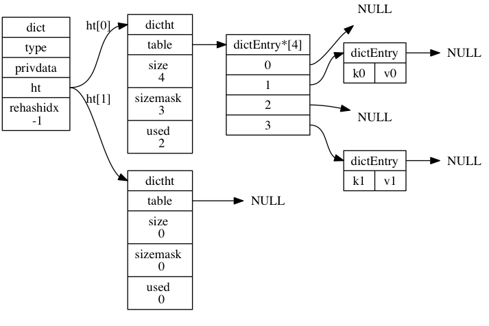

# 数据结构和对象

## 简单动态字符串
Redis没有直接使用C里面的字符串，而是构建了一种名为简单动态字符串(Simple dynamic strings, SDS)的抽象类型，并且作为Redis的默认字符串表示。
> 相关源文件： [sds.c](https://github.com/antirez/redis/blob/5.0/src/sds.c), [sds.h](https://github.com/antirez/redis/blob/5.0/src/sds.h), [sdsalloc.h](https://github.com/antirez/redis/blob/5.0/src/sdsalloc.h), [zmalloc.c](https://github.com/antirez/redis/blob/5.0/src/zmalloc.c), [zmalloc.h](https://github.com/antirez/redis/blob/5.0/src/zmalloc.h)

### 数据结构
`sdsalloc.h`很简单，只是引入了SDS的内存管理模块而已（源码如下）。而真正的内存管理是在`zmalloc.h`和`zmalloc.c`中定义和实现的，具体实现请看[这里](./zmalloc.md)。
```c
#include "zmalloc.h"
#define s_malloc zmalloc
#define s_realloc zrealloc
#define s_free zfree
```
简单动态字符串的具体是在`sds.c`和`sds.h`中实现的。在头文件中定义了两种主要的类型，`sds`和`sdshdr##T`。

```c
typedef char *sds;

/* Note: sdshdr5 is never used, we just access the flags byte directly.
 * However is here to document the layout of type 5 SDS strings. */
struct __attribute__ ((__packed__)) sdshdr5 {
    /* __attribute__ ((__packed__)) 取消字节对齐*/
    unsigned char flags; /* 3 lsb of type, and 5 msb of string length */
    char buf[];
};
struct __attribute__ ((__packed__)) sdshdr8 {
    uint8_t len; /* used */
    uint8_t alloc; /* excluding the header and null terminator */
    unsigned char flags; /* 3 lsb of type, 5 unused bits */
    char buf[];
};
struct __attribute__ ((__packed__)) sdshdr16 {
    uint16_t len; /* used */
    uint16_t alloc; /* excluding the header and null terminator */
    unsigned char flags; /* 3 lsb of type, 5 unused bits */
    char buf[];
};
struct __attribute__ ((__packed__)) sdshdr32 {
    uint32_t len; /* used */
    uint32_t alloc; /* excluding the header and null terminator */
    unsigned char flags; /* 3 lsb of type, 5 unused bits */
    char buf[];
};
struct __attribute__ ((__packed__)) sdshdr64 {
    uint64_t len; /* used */
    uint64_t alloc; /* excluding the header and null terminator */
    unsigned char flags; /* 3 lsb of type, 5 unused bits */
    char buf[];
};
```
作者共定义了五种类型的`sdshdr`，主要是为了内存的优化，节省内存，毕竟sds是redis中最常用到的数据类型。`__attribute__ ((__packed__))` 也是为了告诉编译器取消字节对齐优化。其中`sdshdr5`没有使用过。

整个SDS的内存是连续的的，统一开辟的，`sdshdr`结构体后面紧跟着字符串`sds`。结构体的最后一个成员`char buf[];`是一个元素个数为0的字符数组，并不占用内存空间，为了指示在结构体后面才是字符串的实体所在。所以在`sds.h`中呢就有这么些骚操作：

### 数据操作技巧
1. sds和sdshdr
```c
// 根据字符串sds拿到sdshdr结构体的指针。
//    字符串sds减去相应结构体的大小得到结构体
#define SDS_HDR_VAR(T,s) struct sdshdr##T *sh = (void*)((s)-(sizeof(struct sdshdr##T)));
// 根据字符串sds拿到sdshdr结构体的地址
#define SDS_HDR(T,s) ((struct sdshdr##T *)((s)-(sizeof(struct sdshdr##T))))
```

2. sds和flags
```c{6}
static inline size_t sdslen(const sds s) {
    /*
     * inline关键字仅仅是建议编译器做内联展开处理，而不是强制。在gcc编译器中，如果编译优化设置为-O0，即使是inline函数也不会被内联展开，
     * 除非设置了强制内联（__attribute__((always_inline))）属性。
     * */
    unsigned char flags = s[-1];
    switch(flags&SDS_TYPE_MASK) {
        case SDS_TYPE_5:
            return SDS_TYPE_5_LEN(flags);
        case SDS_TYPE_8:
            return SDS_HDR(8,s)->len;
        case SDS_TYPE_16:
            return SDS_HDR(16,s)->len;
        case SDS_TYPE_32:
            return SDS_HDR(32,s)->len;
        case SDS_TYPE_64:
            return SDS_HDR(64,s)->len;
    }
    return 0;
}
```
看代码第6行，这就很厉害了，字符串前一个字节就是`flags`，-1 就拿到了类型的值，进而就知道这个s(sds)前面的sdshdr的地址。

### 创建SDS

先计算C字符串的长度
```c
sds sdsnew(const char *init) {
    size_t initlen = (init == NULL) ? 0 : strlen(init);
    return sdsnewlen(init, initlen);
}
```
根据长度和字符串创建SDS
```c
sds sdsnewlen(const void *init, size_t initlen) {
    void *sh;
    sds s;
    char type = sdsReqType(initlen); /* 根据字符串的长度选择合适的sdshdr类型 */
    /* Empty strings are usually created in order to append. Use type 8
     * since type 5 is not good at this. */
    if (type == SDS_TYPE_5 && initlen == 0) type = SDS_TYPE_8;
    int hdrlen = sdsHdrSize(type);
    unsigned char *fp;

    sh = s_malloc(hdrlen+initlen+1);  /* sds结构长度+起始字符串长度+末尾空字符（1）*/
    if (init==SDS_NOINIT)
        init = NULL;
    else if (!init)
        memset(sh, 0, hdrlen+initlen+1);
    if (sh == NULL) return NULL;
    s = (char*)sh+hdrlen; /* 跳到结构体的最后，拿到sds的指针 */
    fp = ((unsigned char*)s)-1; /* 回过头来拿到结构体中flags成员的指针 */
    switch(type) { /* 初始化结构体成员 */
        case SDS_TYPE_5: {
            *fp = type | (initlen << SDS_TYPE_BITS);
            break;
        }
        case SDS_TYPE_8: {
            SDS_HDR_VAR(8,s);
            sh->len = initlen;
            sh->alloc = initlen;
            *fp = type;
            break;
        }
        case SDS_TYPE_16: {
            SDS_HDR_VAR(16,s);
            sh->len = initlen;
            sh->alloc = initlen;
            *fp = type;
            break;
        }
        case SDS_TYPE_32: {
            SDS_HDR_VAR(32,s);
            sh->len = initlen;
            sh->alloc = initlen;
            *fp = type;
            break;
        }
        case SDS_TYPE_64: {
            SDS_HDR_VAR(64,s);
            sh->len = initlen;
            sh->alloc = initlen;
            *fp = type;
            break;
        }
    }
    if (initlen && init)
        memcpy(s, init, initlen); /* 把字符串保存到sds中 */
    s[initlen] = '\0';  /* 加上\0作为字符串结束符 */
    return s;
}
```
就是如此高雅简洁！

### SDS 字符拼接
对字符串进行拼接是常有的操作。`sdscat`和`strcat`有很大的区别。

`sdscat`

```c
sds sdscat(sds s, const char *t) {
    return sdscatlen(s, t, strlen(t));
}
```

`sdscatlen`
```c
sds sdscatlen(sds s, const void *t, size_t len) {
    // 获取当前SDS的长度，sdshdr->len
    size_t curlen = sdslen(s);

    s = sdsMakeRoomFor(s,len);
    if (s == NULL) return NULL;
    // 将目标字符串的内容复制到原SDS后面
    memcpy(s+curlen, t, len);
    // 重新设置sds的长度，即更新sdshdr->len
    sdssetlen(s, curlen+len);
    // sds后面加上'\0'
    s[curlen+len] = '\0';
    return s;
}
```
`sdscatlen`函数的核心是`sdsMakeRoomFor`，它是如何杜绝SDS缓冲区溢出的呢？

```c
sds sdsMakeRoomFor(sds s, size_t addlen) {
    void *sh, *newsh;
    // 计算SDS剩余缓存大小： sdshdr->alloc - sdshdr->len
    size_t avail = sdsavail(s);
    size_t len, newlen;
    char type, oldtype = s[-1] & SDS_TYPE_MASK;
    int hdrlen;

    /* 剩余空间足够addlen长度字符的加入，立即返回 */
    if (avail >= addlen) return s;

    // 当前SDS使用了的长度 sdshdr->len
    len = sdslen(s);
    // 获取SDS的sdshdr结构体的指针
    sh = (char*)s-sdsHdrSize(oldtype);
    newlen = (len+addlen);
    // SDS_MAX_PREALLOC： 字符串最大的预分配长度是1M
    if (newlen < SDS_MAX_PREALLOC)
        newlen *= 2;
    else
        newlen += SDS_MAX_PREALLOC;

    // 根据新的sds字符串的长度重新计算sdshdr的类型
    type = sdsReqType(newlen);

    /* Don't use type 5: the user is appending to the string and type 5 is
     * not able to remember empty space, so sdsMakeRoomFor() must be called
     * at every appending operation. */
    if (type == SDS_TYPE_5) type = SDS_TYPE_8;

    // sdshdr结构体的长度
    hdrlen = sdsHdrSize(type);
    // sdshdr类型没有变，对sdshdr realloc扩容即可
    if (oldtype==type) {
        newsh = s_realloc(sh, hdrlen+newlen+1);
        if (newsh == NULL) return NULL;
        s = (char*)newsh+hdrlen;
    } else {
        /* Since the header size changes, need to move the string forward,
         * and can't use realloc */
        // sdshdr的类型和大小都变了需要创建一个新的sdshdr
        newsh = s_malloc(hdrlen+newlen+1);
        if (newsh == NULL) return NULL;
        // 将s复制到新的sdshdr后面的sds中
        memcpy((char*)newsh+hdrlen, s, len+1);
        // 回收旧的sdshdr
        s_free(sh);
        // 新的sds指针
        s = (char*)newsh+hdrlen;
        // 设置sdshdr的类别
        s[-1] = type;
        // 设置新的sdshdr的长度成员, sdshdr->len
        sdssetlen(s, len);
    }
    sdssetalloc(s, newlen);
    return s;
}
```
描述`sdsMakeRoomFor()`，可以简而言之：原SDS剩余空间够用，直接返回；空间不够，则重新创建一个新的sdshdr，将原SDS复制到新的sdshdr后的SDS中。

关于扩容长度策略：
1. 当修改后SDS字符串长度小于 `SDS_MAX_PREALLOC`（1M）时，扩容长度为修改后字符串长度的两倍。
2. 当修改后的SDS字符串长度大于`SDS_MAX_PREALLOC`时，扩容的长度为修改后字符串长度加上`SDS_MAX_PREALLOC`,即新的字符长度+1m大小。

和`sdsMakeRoomFor()`函数相反，SDS时通过`sdsRemoveFreeSpace()`函数实现惰性空间释放。其原理于前者类似，sdshdr类型不变时，直接`realloc`，类型发生了变化时，创建一个新的sdshdr，将sds复制到新的sdshdr后面，回收旧的sdshdr。

### SDS和C字符串的区别
SDS相对于C字符串有以下优势：
1. 常数复杂度获取字符串长度
2. 杜绝缓冲区溢出
3. 减少修改字符串时带来的内存重分配次数
4. 二进制安全
5. 兼容部分C字符串函数，如 `printf("%s", s->buf);`。

### 编译
Redis SDS可以作为独立的模块使用。编译测试：

```shell
gcc -DSDS_TEST_MAIN -o sds sds.c zmalloc.c
```

## 链表
作为一种常用数据结构，C 语言并没有内置这种数据结构，所以 Redis 构建了自己的链表实现。
> 相关源文件： [adlist.h](https://github.com/antirez/redis/blob/5.0/src/adlist.h), [adlist.c](https://github.com/antirez/redis/blob/5.0/src/adlist.c), [zmalloc.h](https://github.com/antirez/redis/blob/5.0/src/zmalloc.h) 

Redis的链表是一个双向链表，使用list结构持有链表。
```c
typedef struct listNode {
    struct listNode *prev;
    struct listNode *next;
    void *value;
} listNode;

typedef struct listIter {
    listNode *next;
    int direction;
} listIter;

/* 使用list持有链表 */
typedef struct list {
    // 表头节点
    listNode *head;
    // 表尾节点
    listNode *tail;
    // 链表所包含的节点数量
    unsigned long len;
    // 节点值复制函数
    void *(*dup)(void *ptr);
    // 节点值释放函数
    void (*free)(void *ptr);
    // 节点值对比函数
    int (*match)(void *ptr, void *key);
} list;
```
Redis链表的实现和常规的类似，不同的是，`list`结构体中有定义的三个指针函数成员`dup` 、`free` 和 `match`，用于指定实现多态链表所需的类型特定函数。

### Redis链表的特点
1. 双端无环，带表头指针和表尾指针
2. 链表长度获取时间复杂度O(1)
3. 多态，链表节点使用 `void*` 指针来保存节点值， 并且可以通过 `list` 结构的 `dup` 、 `free` 、 `match` 三个属性为节点值设置类型特定函数， 所以链表可以用于保存各种不同类型的值。

### 编译
同样，Redis的链表作为Redis的基本数据结构也可以单独作为模块使用。

## 字典
Redis的字典使用的哈希表作为底层实现的，一个哈希表里面可以由多个哈希表节点，每个节点保存了字典中的一个键值对。
> 相关源文件： [dict.h](https://github.com/antirez/redis/blob/5.0/src/dict.h), [dict.c](https://github.com/antirez/redis/blob/5.0/src/dict.c), [zmalloc.h](https://github.com/antirez/redis/blob/5.0/src/zmalloc.h) , [fmacros.h](https://github.com/antirez/redis/blob/5.0/src/fmacros.h), [sds.c](https://github.com/antirez/redis/blob/5.0/src/sds.h), [siphash.c](https://github.com/antirez/redis/blob/5.0/src/siphash.h)

如下图所示展示了一个普通状态下Redis的字典结构：



```c
typedef struct dict {           /* 字典的结构 */
    dictType *type;             /* 类型特定函数 */
    void *privdata;             /* 私有数据 */
    dictht ht[2];               /* 二元哈希表 */
    long rehashidx;             /* rehash索引进度，值为-1时表示没有在进行rehash */
    unsigned long iterators;    /* 当前运行的迭代器个数 */
} dict;
```

`ht`成员是一个两个元素的数组，数组中的每个项都是一个`dictht`哈希表，一般情况下，字典只使用 `ht[0]` 哈希表， `ht[1]` 哈希表只会在对 `ht[0] `哈希表进行 `rehash` 时使用。`rehashidx` 记录着当前字典`rehash`索引进度，值为-1时表示没有在进行`rehash`。Redis的哈希表结构体`dicht`，其结构如下：

```c
typedef struct dictht {         /* 哈希表的结构 */
    dictEntry **table;          /* 哈希表数组，每个元素都是指向dictEntry的指针 */
    unsigned long size;         /* 哈希表的大小 */
    unsigned long sizemask;     /* 哈希表大小掩码，用于计算索引值，总是等于size-1*/
    unsigned long used;         /* 该哈希表已有的节点（键值对）数目 */
} dictht;
```
起始元素个数为 DICT_HT_INITIAL_SIZE


### 编译
Redis字典依赖于SDS，可以通过下面的方法编译测试。

```shell
gcc -DDICT_BENCHMARK_MAIN -o dict dict.c sds.c zmalloc.c siphash.c 
```


## 参考
1. [Redis 设计与实现](http://redisbook.com/)


